# 🏗️ Inception - Docker Infrastructure Architecture

<div align="center">


**Complete Containerized Infrastructure with Docker Compose**

[](https://docs.docker.com/compose/)
[](https://www.docker.com)
[](https://microservices.io)
[](https://42.fr)

</div>

---

## 📋 Table of Contents

- [🎯 Architecture Overview](#-architecture-overview)
- [🐳 Docker Compose Orchestration](#-docker-compose-orchestration)
- [🔄 Service Communication](#-service-communication)
- [📊 Data Flow Architecture](#-data-flow-architecture)
- [🌐 Network Topology](#-network-topology)
- [📈 Scaling & Performance](#-scaling--performance)
- [🛡️ Security Architecture](#️-security-architecture)
- [🚀 Deployment Strategy](#-deployment-strategy)
- [📊 Monitoring & Health](#-monitoring--health)
- [🔧 Development Workflow](#-development-workflow)

---

## 🎯 Architecture Overview

The **Inception Project** implements a complete containerized infrastructure using Docker Compose, featuring a multi-tier architecture with clear separation of concerns and microservices principles.

### System Architecture

```mermaid
graph TB
    subgraph "External Layer"
        USERS[👥 Users]
        ADMIN[🔧 Administrators]
        DEV[👨‍💻 Developers]
    end
    
    subgraph "Presentation Layer"
        NGINX[🌍 Nginx<br/>Reverse Proxy<br/>Port: 443]
        SSL[🔒 SSL/TLS<br/>Termination]
    end
    
    subgraph "Application Layer"
        WP[🌐 WordPress<br/>CMS Application<br/>Port: 9000]
        WEBSITE[📄 Static Website<br/>Portfolio<br/>Port: 80]
        ADMINER[🗄️ Adminer<br/>DB Management<br/>Port: 8080]
    end
    
    subgraph "Service Layer"
        FTP[📁 FTP Server<br/>File Management<br/>Port: 21]
        REDIS[⚡ Redis<br/>Cache Layer<br/>Port: 6379]
    end
    
    subgraph "Data Layer"
        MARIADB[🗄️ MariaDB<br/>Database Server<br/>Port: 3306]
        VOLUMES[💾 Persistent Volumes<br/>Data Storage]
    end
    
    subgraph "Management Layer"
        PORTAINER[🐳 Portainer<br/>Container Management<br/>Port: 9000]
        DOCKER[🐋 Docker Engine<br/>Container Runtime]
    end
    
    USERS --> NGINX
    ADMIN --> NGINX
    DEV --> NGINX
    
    NGINX --> SSL
    SSL --> WP
    SSL --> WEBSITE
    SSL --> ADMINER
    SSL --> PORTAINER
    
    WP --> REDIS
    WP --> MARIADB
    WP --> FTP
    
    ADMINER --> MARIADB
    FTP --> VOLUMES
    MARIADB --> VOLUMES
    
    PORTAINER --> DOCKER
    DOCKER --> WP
    DOCKER --> MARIADB
    DOCKER --> REDIS
    DOCKER --> FTP
    DOCKER --> ADMINER
    DOCKER --> WEBSITE
    
    style NGINX fill:#009639
    style WP fill:#21759b
    style MARIADB fill:#003545
    style REDIS fill:#dc382d
    style PORTAINER fill:#13bef9
```



### Service Distribution

| Layer | Services | Purpose | Dependencies |
|-------|----------|---------|--------------|
| **Proxy** | Nginx | SSL termination, routing | - |
| **Core Apps** | WordPress, Website | Content management, presentation | MariaDB, Redis |
| **Bonus Apps** | Adminer, FTP, Portainer | Management, file transfer, monitoring | MariaDB, Docker |
| **Infrastructure** | MariaDB, Redis | Data persistence, caching | Volumes |

---

## 🐳 Docker Compose Orchestration

### Service Definition Structure

```yaml
# docker-compose.yml - Complete infrastructure definition
version: '3.8'

services:
  # === CORE INFRASTRUCTURE ===
  nginx:
    build: ./requirements/nginx
    container_name: nginx
    ports:
      - "443:443"
      - "80:80"
    volumes:
      - wordpress_data:/var/www/html
      - nginx_ssl:/etc/nginx/ssl
    networks:
      - inception_network
    depends_on:
      - wordpress
      - website
    restart: unless-stopped
    healthcheck:
      test: ["CMD", "curl", "-f", "https://localhost/"]
      interval: 30s
      timeout: 10s
      retries: 3

  wordpress:
    build: ./requirements/wordpress
    container_name: wordpress
    volumes:
      - wordpress_data:/var/www/html
    networks:
      - inception_network
    depends_on:
      mariadb:
        condition: service_healthy
      redis:
        condition: service_started
    environment:
      - WORDPRESS_DB_HOST=mariadb:3306
      - REDIS_HOST=redis:6379
    restart: unless-stopped

  mariadb:
    build: ./requirements/mariadb
    container_name: mariadb
    volumes:
      - mariadb_data:/var/lib/mysql
    networks:
      - inception_network
    environment:
      - MYSQL_ROOT_PASSWORD=${MYSQL_ROOT_PASSWORD}
      - MYSQL_DATABASE=${MYSQL_DATABASE}
    restart: unless-stopped
    healthcheck:
      test: ["CMD", "mysqladmin", "ping", "-h", "localhost"]
      interval: 10s
      timeout: 5s
      retries: 5

  # === BONUS SERVICES ===
  redis:
    build: ./requirements/bonus/redis
    container_name: redis
    volumes:
      - redis_data:/data
    networks:
      - inception_network
    restart: unless-stopped

  adminer:
    build: ./requirements/bonus/adminer
    container_name: adminer
    networks:
      - inception_network
    depends_on:
      - mariadb
    restart: unless-stopped

  ftp-server:
    build: ./requirements/bonus/ftp-server
    container_name: ftp-server
    ports:
      - "21:21"
      - "21000-21010:21000-21010"
    volumes:
      - wordpress_data:/var/www/html
    networks:
      - inception_network
    restart: unless-stopped

  website:
    build: ./requirements/bonus/website
    container_name: website
    networks:
      - inception_network
    restart: unless-stopped

  portainer:
    image: portainer/portainer-ce:latest
    container_name: portainer
    volumes:
      - /var/run/docker.sock:/var/run/docker.sock
      - portainer_data:/data
    networks:
      - inception_network
    restart: unless-stopped
```

### Orchestration Flow


---

## 🔄 Service Communication

### Internal Communication Matrix


### Protocol Stack

| Service Pair | Protocol | Port | Purpose | Encryption |
|-------------|----------|------|---------|------------|
| **Nginx ↔ WordPress** | FastCGI | 9000 | Web serving | Internal |
| **WordPress ↔ MariaDB** | MySQL | 3306 | Database queries | Internal |
| **WordPress ↔ Redis** | Redis | 6379 | Cache operations | Internal |
| **Adminer ↔ MariaDB** | MySQL | 3306 | DB administration | Internal |
| **FTP ↔ WordPress** | File System | - | File management | Volume mount |
| **Nginx ↔ External** | HTTPS | 443 | Web access | SSL/TLS |

---

## 📊 Data Flow Architecture

### Request Processing Flow


### Data Persistence Strategy


---

## 🌐 Network Topology

### Docker Network Architecture

```yaml
# Network configuration
networks:
  inception_network:
    driver: bridge
    ipam:
      driver: default
      config:
        - subnet: 172.20.0.0/16
          gateway: 172.20.0.1
    driver_opts:
      com.docker.network.bridge.enable_icc: "true"
      com.docker.network.bridge.enable_ip_masquerade: "true"
```

### Service Network Map


### Security Boundaries


---

## 📈 Scaling & Performance

### Horizontal Scaling Strategy

```yaml
# Scalable service configuration
wordpress:
  build: ./requirements/wordpress
  deploy:
    replicas: 3
    update_config:
      parallelism: 1
      delay: 10s
    restart_policy:
      condition: on-failure
      delay: 5s
      max_attempts: 3
  networks:
    - inception_network

# Load balancer configuration
nginx:
  build: ./requirements/nginx
  depends_on:
    - wordpress
  deploy:
    replicas: 2
    placement:
      constraints:
        - node.role == manager
```

### Performance Optimization Stack


### Resource Allocation

| Service | CPU Limit | Memory Limit | Priority | Scaling |
|---------|-----------|--------------|----------|---------|
| **Nginx** | 0.5 CPU | 512MB | High | Horizontal |
| **WordPress** | 1.0 CPU | 1GB | High | Horizontal |
| **MariaDB** | 1.5 CPU | 2GB | Critical | Vertical |
| **Redis** | 0.5 CPU | 512MB | Medium | Vertical |
| **Adminer** | 0.2 CPU | 256MB | Low | Single |
| **FTP Server** | 0.3 CPU | 256MB | Low | Single |
| **Website** | 0.2 CPU | 128MB | Low | Horizontal |
| **Portainer** | 0.3 CPU | 512MB | Low | Single |

---

## 🛡️ Security Architecture

### Multi-Layer Security Model


### Security Configuration Matrix

| Component | Security Feature | Implementation | Status |
|-----------|------------------|----------------|--------|
| **Nginx** | SSL/TLS | Let's Encrypt certificates | ✅ |
| **WordPress** | Authentication | Admin/User separation | ✅ |
| **MariaDB** | Network isolation | Docker internal only | ✅ |
| **Redis** | Access control | Password protection | ✅ |
| **FTP** | FTPS encryption | SSL/TLS for transfers | ✅ |
| **Portainer** | RBAC | Role-based access control | ✅ |
| **Secrets** | Environment isolation | Docker secrets/env files | ✅ |

---

## 🚀 Deployment Strategy

### Infrastructure as Code

```bash
#!/bin/bash
# deploy.sh - Complete deployment automation

set -e

echo "🚀 Starting Inception deployment..."

# Environment validation
check_environment() {
    echo "📋 Validating environment..."
    
    if [ ! -f .env ]; then
        echo "❌ .env file not found"
        exit 1
    fi
    
    if ! docker --version >/dev/null 2>&1; then
        echo "❌ Docker not installed"
        exit 1
    fi
    
    if ! docker-compose --version >/dev/null 2>&1; then
        echo "❌ Docker Compose not installed"
        exit 1
    fi
    
    echo "✅ Environment validated"
}

# Infrastructure deployment
deploy_infrastructure() {
    echo "🏗️ Deploying infrastructure..."
    
    # Create networks
    docker network create inception_network 2>/dev/null || true
    
    # Build and start services
    docker-compose build --no-cache
    docker-compose up -d
    
    echo "✅ Infrastructure deployed"
}

# Health verification
verify_health() {
    echo "🔍 Verifying service health..."
    
    local services=("nginx" "wordpress" "mariadb" "redis")
    
    for service in "${services[@]}"; do
        echo "Checking $service..."
        docker-compose exec -T "$service" echo "Service responsive" || {
            echo "❌ $service not responding"
            return 1
        }
    done
    
    echo "✅ All services healthy"
}

# Post-deployment configuration
post_deployment() {
    echo "⚙️ Running post-deployment tasks..."
    
    # WordPress setup
    docker-compose exec wordpress wp core install \
        --url="https://${DOMAIN_NAME}" \
        --title="Inception WordPress" \
        --admin_user="${WP_ADMIN_USER}" \
        --admin_password="${WP_ADMIN_PASS}" \
        --admin_email="${WP_ADMIN_EMAIL}" \
        --allow-root
    
    # Enable Redis cache
    docker-compose exec wordpress wp plugin activate redis-cache --allow-root
    
    echo "✅ Post-deployment complete"
}

# Main deployment flow
main() {
    check_environment
    deploy_infrastructure
    sleep 30  # Allow services to start
    verify_health
    post_deployment
    
    echo "🎉 Inception deployment successful!"
    echo "🌐 Access: https://${DOMAIN_NAME}"
    echo "🐳 Portainer: https://${DOMAIN_NAME}:9443"
}

main "$@"
```

### Blue-Green Deployment

```yaml
# docker-compose.blue-green.yml
version: '3.8'

services:
  # Blue environment (current)
  wordpress-blue:
    build: ./requirements/wordpress
    container_name: wordpress-blue
    environment:
      - ENV_COLOR=blue
    networks:
      - inception_network

  # Green environment (new version)
  wordpress-green:
    build: ./requirements/wordpress
    container_name: wordpress-green
    environment:
      - ENV_COLOR=green
    networks:
      - inception_network
    profiles:
      - green

  # Load balancer with traffic switching
  nginx:
    build: ./requirements/nginx
    environment:
      - ACTIVE_ENV=blue  # Switch to 'green' for deployment
    depends_on:
      - wordpress-blue
```

---

## 📊 Monitoring & Health

### Comprehensive Monitoring Stack


### Health Check Configuration

```yaml
# Comprehensive health checks
services:
  nginx:
    healthcheck:
      test: ["CMD", "curl", "-f", "https://localhost/health"]
      interval: 30s
      timeout: 10s
      retries: 3
      start_period: 40s

  wordpress:
    healthcheck:
      test: ["CMD", "curl", "-f", "http://localhost:9000/wp-admin/admin-ajax.php"]
      interval: 30s
      timeout: 10s
      retries: 3

  mariadb:
    healthcheck:
      test: ["CMD", "mysqladmin", "ping", "-h", "localhost", "-u", "root", "-p${MYSQL_ROOT_PASSWORD}"]
      interval: 10s
      timeout: 5s
      retries: 5

  redis:
    healthcheck:
      test: ["CMD", "redis-cli", "ping"]
      interval: 30s
      timeout: 3s
      retries: 3
```

### Monitoring Dashboard

```bash
#!/bin/bash
# monitor.sh - Infrastructure monitoring script

monitor_services() {
    echo "=== INCEPTION INFRASTRUCTURE MONITORING ==="
    echo "Timestamp: $(date)"
    echo
    
    # Container status
    echo "📊 Container Status:"
    docker-compose ps --format "table {{.Name}}\t{{.State}}\t{{.Status}}"
    echo
    
    # Resource usage
    echo "💻 Resource Usage:"
    docker stats --no-stream --format "table {{.Container}}\t{{.CPUPerc}}\t{{.MemUsage}}\t{{.MemPerc}}\t{{.NetIO}}\t{{.BlockIO}}"
    echo
    
    # Health checks
    echo "🏥 Health Status:"
    for service in nginx wordpress mariadb redis; do
        health=$(docker inspect --format='{{.State.Health.Status}}' "$service" 2>/dev/null || echo "no-health-check")
        case $health in
            "healthy") icon="✅" ;;
            "unhealthy") icon="❌" ;;
            "starting") icon="🟡" ;;
            *) icon="⚪" ;;
        esac
        echo "$icon $service: $health"
    done
    echo
    
    # Network connectivity
    echo "🌐 Network Connectivity:"
    docker-compose exec -T wordpress ping -c 1 mariadb >/dev/null 2>&1 && echo "✅ WordPress → MariaDB" || echo "❌ WordPress → MariaDB"
    docker-compose exec -T wordpress ping -c 1 redis >/dev/null 2>&1 && echo "✅ WordPress → Redis" || echo "❌ WordPress → Redis"
    docker-compose exec -T adminer ping -c 1 mariadb >/dev/null 2>&1 && echo "✅ Adminer → MariaDB" || echo "❌ Adminer → MariaDB"
    echo
    
    # Storage usage
    echo "💾 Storage Usage:"
    docker system df
    echo
    
    echo "=================================================="
}

# Run monitoring
monitor_services
```

---

## 🔧 Development Workflow

### Development Environment Setup

```bash
#!/bin/bash
# dev-setup.sh - Development environment initialization

setup_development() {
    echo "🛠️ Setting up development environment..."
    
    # Create development overrides
    cat > docker-compose.override.yml << EOF
version: '3.8'

services:
  wordpress:
    volumes:
      - ./requirements/wordpress/src:/var/www/html/wp-content/themes/custom
    environment:
      - WP_DEBUG=true
      - WP_DEBUG_LOG=true
      - SCRIPT_DEBUG=true

  nginx:
    volumes:
      - ./logs/nginx:/var/log/nginx

  mariadb:
    ports:
      - "3306:3306"  # Expose for development tools
    environment:
      - MYSQL_GENERAL_LOG=1
EOF
    
    # Create development scripts
    mkdir -p scripts/dev
    
    # Hot reload script
    cat > scripts/dev/hot-reload.sh << 'EOF'
#!/bin/bash
# Watch for changes and restart services
inotifywait -m -r --format '%w%f %e' requirements/ | while read file event; do
    if [[ "$event" == "MODIFY" ]]; then
        service=$(echo "$file" | cut -d'/' -f2)
        echo "Restarting $service due to changes in $file"
        docker-compose restart "$service"
    fi
done
EOF
    
    chmod +x scripts/dev/hot-reload.sh
    
    echo "✅ Development environment ready"
}

# Development utilities
dev_tools() {
    echo "🔧 Available development tools:"
    echo "  - Hot reload: ./scripts/dev/hot-reload.sh"
    echo "  - Logs: docker-compose logs -f [service]"
    echo "  - Shell: docker-compose exec [service] bash"
    echo "  - DB access: docker-compose exec mariadb mysql -u root -p"
    echo "  - WordPress CLI: docker-compose exec wordpress wp --allow-root"
}

setup_development
dev_tools
```

### Testing & Validation

```bash
#!/bin/bash
# test.sh - Infrastructure testing suite

run_integration_tests() {
    echo "🧪 Running integration tests..."
    
    # Test service connectivity
    test_connectivity() {
        echo "Testing service connectivity..."
        
        # WordPress to MariaDB
        docker-compose exec -T wordpress php -r "
            \$conn = new mysqli('mariadb', '$MYSQL_USER', '$MYSQL_PASSWORD', '$MYSQL_DATABASE');
            echo \$conn->connect_error ? 'FAIL' : 'PASS';
        " | grep -q "PASS" && echo "✅ WordPress → MariaDB" || echo "❌ WordPress → MariaDB"
        
        # WordPress to Redis
        docker-compose exec -T wordpress php -r "
            \$redis = new Redis();
            \$connected = \$redis->connect('redis', 6379);
            echo \$connected ? 'PASS' : 'FAIL';
        " | grep -q "PASS" && echo "✅ WordPress → Redis" || echo "❌ WordPress → Redis"
    }
    
    # Test web endpoints
    test_endpoints() {
        echo "Testing web endpoints..."
        
        local endpoints=(
            "https://localhost/"
            "https://localhost/wp-admin/"
            "https://localhost/adminer/"
            "https://localhost:9443/"
        )
        
        for endpoint in "${endpoints[@]}"; do
            if curl -ksf "$endpoint" >/dev/null 2>&1; then
                echo "✅ $endpoint"
            else
                echo "❌ $endpoint"
            fi
        done
    }
    
    # Performance tests
    test_performance() {
        echo "Testing performance..."
        
        # Page load time
        time_taken=$(curl -w "%{time_total}" -o /dev/null -s https://localhost/)
        echo "📊 Homepage load time: ${time_taken}s"
        
        # Database query time
        db_time=$(docker-compose exec -T mariadb mysql -u "$MYSQL_USER" -p"$MYSQL_PASSWORD" "$MYSQL_DATABASE" -e "SELECT BENCHMARK(1000, MD5('test'));" 2>/dev/null | tail -1)
        echo "📊 Database performance: $db_time"
    }
    
    test_connectivity
    test_endpoints
    test_performance
}

run_integration_tests
```

---

<div align="center">

### 🎯 Inception Project Summary

This documentation provides the **complete architectural overview** of the Inception Docker infrastructure, showcasing enterprise-grade containerization, orchestration, and microservices architecture principles.

**Key Achievements:**
- 🏗️ **8-Service Architecture** with clear separation of concerns
- 🐳 **Docker Compose Orchestration** with dependency management
- 🔄 **Service Communication** via optimized internal networking  
- 📊 **Performance Optimization** with multi-layer caching
- 🛡️ **Security Architecture** with defense in depth
- 📈 **Scalability Design** ready for production deployment
- 🔧 **DevOps Workflow** with automated deployment and monitoring

**Service Ecosystem:**
- [🌍 Nginx](requirements/nginx/README.md) - Reverse Proxy & SSL Termination
- [🌐 WordPress](requirements/wordpress/README.md) - Content Management System
- [🗄️ MariaDB](requirements/mariadb/README.md) - Database Server
- [⚡ Redis](requirements/bonus/redis/README.md) - High-Performance Cache
- [🗄️ Adminer](requirements/bonus/adminer/README.md) - Database Management
- [📁 FTP Server](requirements/bonus/ftp-server/README.md) - File Transfer Protocol
- [📄 Website](requirements/bonus/website/README.md) - Static Portfolio Site
- [🐳 Portainer](requirements/bonus/portainer/README.md) - Container Management

---

**Developed with ❤️ for 42 School**  
*sternero - 42 Málaga (2025)*

**🎉 Complete Infrastructure Documentation**

</div>
