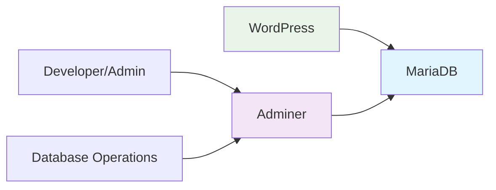
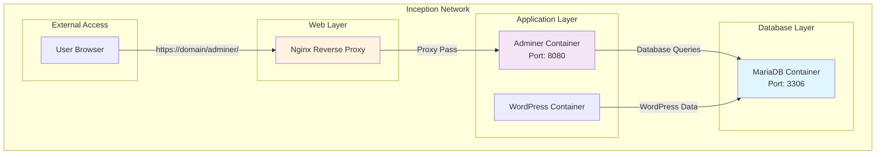

# 🗄️ Adminer - Database Management Interface

<div align="center">


**Professional Database Administration Tool**

[](https://php.net)
[](https://mysql.com)
[](https://docker.com)
[](https://opensource.org/licenses/Apache-2.0)

</div>

---

## 📋 Table of Contents

- [🎯 Overview](#-overview)
- [🚀 Features](#-features)
- [🏗️ Architecture](#️-architecture)
- [🔧 Configuration](#-configuration)
- [🌐 Service Integration](#-service-integration)
- [📊 Usage Examples](#-usage-examples)
- [🛡️ Security](#️-security)
- [🔍 Troubleshooting](#-troubleshooting)
- [📚 Resources](#-resources)

---

## 🎯 Overview

**Adminer** is a full-featured database management tool written in PHP. In the Inception project, it serves as the primary interface for administering the MariaDB database that powers WordPress.

### What is Adminer?

Adminer is a lightweight, single-file database administration tool that provides a web-based interface for managing databases. It's often considered a more modern and user-friendly alternative to phpMyAdmin.

### Why Adminer in Inception?



- **🎯 Direct Database Access**: Provides direct access to MariaDB without SSH
- **🔍 WordPress Debugging**: Essential for troubleshooting WordPress issues
- **📊 Data Visualization**: View and edit WordPress tables and data
- **🛠️ Development Tool**: Perfect for development and testing environments

---

## 🚀 Features

### Core Capabilities

| Feature | Description | Use Case |
|---------|-------------|----------|
| **Multi-Database Support** | MySQL, PostgreSQL, SQLite, MS SQL | Connect to MariaDB in our stack |
| **Query Editor** | SQL query execution with syntax highlighting | Custom database operations |
| **Table Management** | Create, alter, drop tables with GUI | WordPress schema modifications |
| **Data Import/Export** | SQL, CSV export/import functionality | Backup and restore operations |
| **User Management** | Database user and permission management | Security administration |
| **Mobile Responsive** | Works on tablets and mobile devices | Administration on-the-go |

### Adminer vs phpMyAdmin

```
┌─────────────────┬──────────────┬─────────────────┐
│ Feature         │ Adminer      │ phpMyAdmin      │
├─────────────────┼──────────────┼─────────────────┤
│ File Size       │ 470 KB       │ 11 MB           │
│ Installation    │ Single file  │ Complex setup   │
│ Performance     │ Fast         │ Resource heavy  │
│ UI Design       │ Modern       │ Traditional     │
│ Security        │ Better       │ More vulnerabilities│
│ Customization   │ Plugin-based │ Extensive       │
└─────────────────┴──────────────┴─────────────────┘
```

---

## 🏗️ Architecture

### Container Structure

```
adminer/
├── 📄 Dockerfile                # Container definition
├── 📄 .dockerignore             # Build exclusions
├── 📁 conf/                     # Configuration files
│   ├── 📄 adminer.php           # Auto-login configuration
│   └── 📄 php.ini               # PHP optimization settings
└── 📄 README.md                 # This documentation
```

### Network Integration



### Technical Stack

- **Base Image**: `php:8.2-apache`
- **Database Driver**: MySQLi/PDO
- **Web Server**: Apache HTTP Server
- **PHP Version**: 8.2 (Latest stable)
- **Adminer Version**: 4.8.1 (Latest)

---

## 🔧 Configuration

### Dockerfile Highlights

```dockerfile
FROM php:8.2-apache

# Install MySQL extensions
RUN docker-php-ext-install mysqli pdo pdo_mysql

# Download and configure Adminer
RUN curl -L https://github.com/vrana/adminer/releases/download/v4.8.1/adminer-4.8.1.php \
    -o /var/www/html/index.php

# Custom auto-login configuration
COPY conf/adminer.php /var/www/html/adminer.php
```

### Environment Variables

| Variable | Description | Default Value |
|----------|-------------|---------------|
| `MYSQL_HOST` | MariaDB hostname | `mariadb` |
| `MYSQL_PORT` | Database port | `3306` |
| `MYSQL_USER` | Database username | From `.env` |
| `MYSQL_PASSWORD` | Database password | From `.env` |
| `MYSQL_DATABASE` | Database name | `wordpress_db` |

### Auto-Login Configuration

The custom `adminer.php` plugin enables seamless integration:

```php
function credentials() {
    return array(
        getenv('MYSQL_HOST'),
        getenv('MYSQL_USER'),
        getenv('MYSQL_PASSWORD'),
        getenv('MYSQL_DATABASE')
    );
}
```

---

## 🌐 Service Integration

### Integration with Inception Stack

```
┌─────────────────────────────────────────────────────────┐
│                    Inception Ecosystem                  │
├─────────────────────────────────────────────────────────┤
│                                                         │
│  ┌──────────────┐    ┌──────────────┐    ┌───────────┐  │
│  │    Nginx     │    │   Adminer    │    │  MariaDB  │  │
│  │              │◄──►│              │◄──►│           │  │
│  │  Port: 443   │    │  Port: 8080  │    │Port: 3306 │  │
│  └──────────────┘    └──────────────┘    └───────────┘  │
│         ▲                     ▲                         │
│         │                     │                         │
│  ┌──────▼──────┐      ┌───────▼──────┐                  │
│  │   User      │      │  WordPress   │                  │
│  │   Browser   │      │  Container   │                  │
│  └─────────────┘      └──────────────┘                  │
│                                                         │
└─────────────────────────────────────────────────────────┘
```

### Communication Flow

1. **User Access**: `https://domain/adminer/` → Nginx → Adminer
2. **Database Connection**: Adminer → MariaDB (Internal network)
3. **WordPress Data**: Shared database between WordPress and Adminer
4. **Real-time Updates**: Changes in Adminer reflect immediately in WordPress

---

## 📊 Usage Examples

### Common Database Operations

#### 1. WordPress User Management

```sql
-- View all WordPress users
SELECT user_login, user_email, user_registered 
FROM wp_users;

-- Create new admin user
INSERT INTO wp_users (user_login, user_pass, user_email, user_registered)
VALUES ('newadmin', MD5('password'), 'admin@example.com', NOW());
```

#### 2. Content Analysis

```sql
-- Count posts by status
SELECT post_status, COUNT(*) as count 
FROM wp_posts 
GROUP BY post_status;

-- Find most commented posts
SELECT p.post_title, COUNT(c.comment_ID) as comment_count
FROM wp_posts p
LEFT JOIN wp_comments c ON p.ID = c.comment_post_ID
WHERE p.post_status = 'publish'
GROUP BY p.ID
ORDER BY comment_count DESC
LIMIT 10;
```

#### 3. Performance Optimization

```sql
-- Check database size
SELECT 
    table_name AS 'Table',
    ROUND(((data_length + index_length) / 1024 / 1024), 2) AS 'Size (MB)'
FROM information_schema.TABLES
WHERE table_schema = 'wordpress_db'
ORDER BY (data_length + index_length) DESC;
```

### WordPress Configuration Tweaks

```sql
-- Update site URL (useful for domain changes)
UPDATE wp_options SET option_value = 'https://newdomain.com' 
WHERE option_name = 'home';

UPDATE wp_options SET option_value = 'https://newdomain.com' 
WHERE option_name = 'siteurl';

-- Enable WordPress debug mode
UPDATE wp_options SET option_value = '1' 
WHERE option_name = 'wp_debug';
```

---

## 🛡️ Security

### Security Measures Implemented

#### 1. Network Isolation
- ✅ Internal Docker network communication only
- ✅ No direct external database access
- ✅ Nginx reverse proxy protection

#### 2. Access Control
```php
// Custom security headers in adminer.php
function credentials() {
    // Auto-fill credentials for internal use only
    return array(
        getenv('MYSQL_HOST'),
        getenv('MYSQL_USER'), 
        getenv('MYSQL_PASSWORD'),
        getenv('MYSQL_DATABASE')
    );
}
```

#### 3. Production Security Notes

⚠️ **Important Security Considerations:**

| Aspect | Development | Production |
|--------|-------------|------------|
| **Auto-login** | ✅ Enabled | ❌ Should disable |
| **Error display** | ✅ Verbose | ❌ Should hide |
| **Access logs** | ✅ Basic | ✅ Comprehensive |
| **HTTPS only** | ✅ Required | ✅ Mandatory |

### Recommended Production Hardening

```bash
# Disable auto-login in production
# Remove credentials() function from adminer.php

# Add IP restrictions in Nginx
location /adminer/ {
    allow 192.168.1.0/24;  # Internal network only
    deny all;
    proxy_pass http://adminer:8080/;
}

# Enable comprehensive logging
access_log /var/log/nginx/adminer.access.log combined;
error_log /var/log/nginx/adminer.error.log warn;
```

---

## 🔍 Troubleshooting

### Common Issues and Solutions

#### 1. Connection Failed to MariaDB

**Symptoms:**
```
Connection failed: SQLSTATE[HY000] [2002] Connection refused
```

**Solutions:**
```bash
# Check MariaDB container status
docker ps | grep mariadb

# Verify network connectivity
docker exec adminer ping mariadb

# Check MariaDB logs
docker logs mariadb

# Restart MariaDB if needed
docker restart mariadb
```

#### 2. Auto-login Not Working

**Symptoms:**
- Adminer shows login form instead of auto-connecting

**Solutions:**
```bash
# Check environment variables
docker exec adminer printenv | grep MYSQL

# Verify configuration file
docker exec adminer cat /var/www/html/adminer.php

# Check database credentials in .env
cat .env | grep -E "(MYSQL_|MARIADB_)"
```

#### 3. Slow Query Performance

**Symptoms:**
- Adminer takes long time to load tables or execute queries

**Solutions:**
```sql
-- Check for long-running queries
SHOW PROCESSLIST;

-- Optimize WordPress database tables
OPTIMIZE TABLE wp_posts, wp_comments, wp_options;

-- Check database size and optimize
ANALYZE TABLE wp_posts;
```

### Debug Commands

```bash
# Container health check
docker exec adminer curl -f http://localhost:8080/ || exit 1

# PHP error logs
docker exec adminer tail -f /var/log/apache2/error.log

# Test database connection
docker exec adminer php -r "
$conn = new mysqli('mariadb', 'user', 'pass', 'wordpress_db');
echo $conn->connect_error ? 'Failed' : 'Success';
"
```

---

## 📚 Resources

### Official Documentation
- [Adminer Official Website](https://www.adminer.org/)
- [Adminer GitHub Repository](https://github.com/vrana/adminer)
- [PHP MySQL Documentation](https://www.php.net/manual/en/book.mysqli.php)

### WordPress Database Schema
- [WordPress Database Description](https://codex.wordpress.org/Database_Description)
- [WordPress Database Tables](https://codex.wordpress.org/Database_Schema)

### Docker & PHP Resources
- [PHP Official Docker Images](https://hub.docker.com/_/php)
- [Docker Networking Guide](https://docs.docker.com/network/)

### Useful Adminer Plugins
- [Adminer Plugins](https://github.com/vrana/adminer/tree/master/plugins)
- [Custom Themes](https://github.com/vrana/adminer/tree/master/designs)

---

<div align="center">

### 🎯 Project Integration

This Adminer service is part of the **Inception Project** - a comprehensive Docker infrastructure featuring WordPress, MariaDB, Nginx, Redis, FTP, and more.

**Related Services:**
- 🌐 [WordPress](../wordpress/README.md) - Content Management System
- 🗄️ [MariaDB](../mariadb/README.md) - Database Server  
- 🌍 [Nginx](../nginx/README.md) - Web Server & Reverse Proxy
- ⚡ [Redis](../redis/README.md) - Caching Layer

---

**Developed with ❤️ for 42 School**  
*sternero - 42 Málaga (2025)*

</div>
