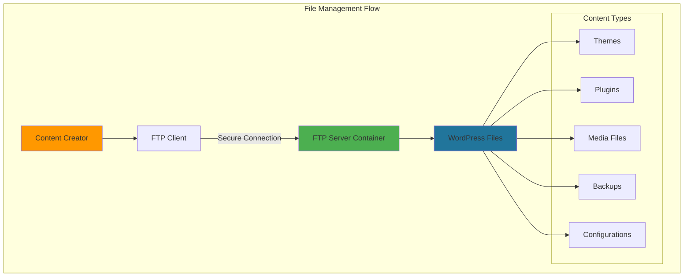
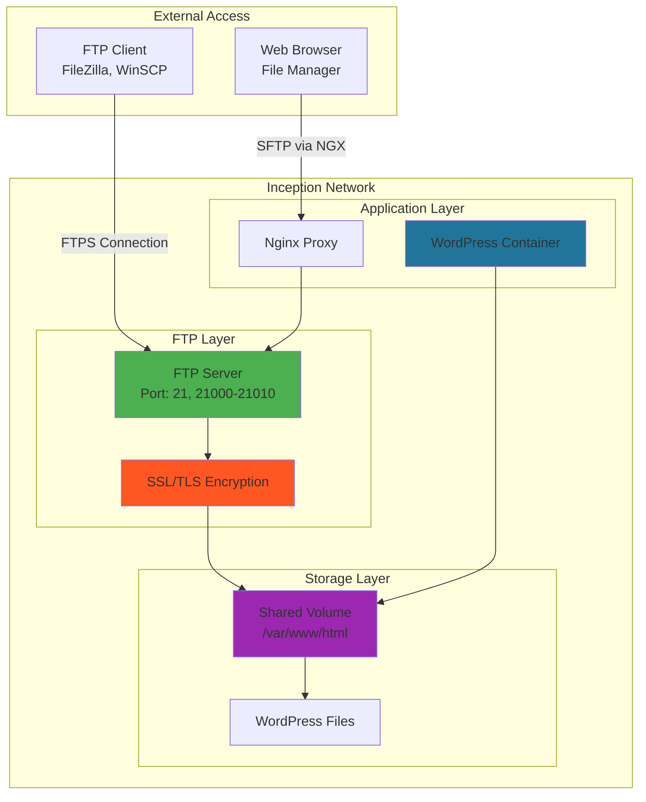
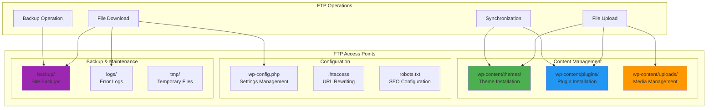
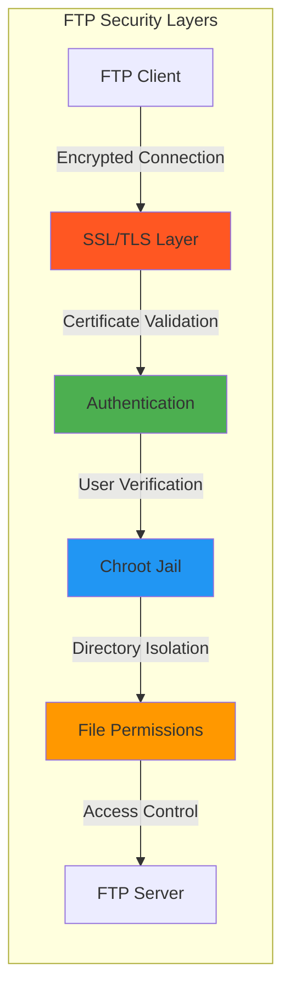

# 📁 FTP Server - File Transfer Protocol Service

<div align="center">


**Secure File Management for WordPress**

[](https://tools.ietf.org/html/rfc959)
[](https://security.appspot.com/vsftpd.html)
[](https://docker.com)
[](https://alpinelinux.org)

</div>

---

## 📋 Table of Contents

- [🎯 Overview](#-overview)
- [🏗️ Architecture](#️-architecture)
- [🔧 Configuration](#-configuration)
- [📂 WordPress Integration](#-wordpress-integration)
- [🔐 Security Features](#-security-features)
- [🚀 Usage Examples](#-usage-examples)
- [📊 File Management](#-file-management)
- [🔍 Troubleshooting](#-troubleshooting)
- [📚 Resources](#-resources)

---

## 🎯 Overview

**FTP Server** provides secure file transfer capabilities for the Inception WordPress infrastructure, enabling remote file management, content uploads, theme installations, and backup operations without requiring direct server access.

### Why FTP in Inception?



### Key Benefits

- **🔒 Secure Transfers**: FTPS with SSL/TLS encryption
- **🌐 Remote Access**: Upload files from anywhere
- **⚡ Efficiency**: Bulk file operations and synchronization
- **🛠️ Development**: Easy theme and plugin deployment
- **💾 Backup**: Automated backup retrieval
- **🔧 Maintenance**: Direct file-level troubleshooting

---

## 🏗️ Architecture

### Container Structure

```
ftp-server/
├── 📄 Dockerfile                    # Container definition
├── 📄 .dockerignore                 # Build exclusions
├── 📁 conf/                         # Configuration files
│   ├── 📄 vsftpd.conf               # Main FTP configuration
│   ├── 📄 ftpusers                  # User restrictions
│   └── 📄 ssl.conf                  # SSL/TLS settings
├── 📁 scripts/                      # Management scripts
│   ├── 📄 create-ftp-user.sh        # User creation script
│   ├── 📄 ftp-backup.sh             # Backup automation
│   ├── 📄 ftp-monitor.sh            # Connection monitoring
│   └── 📄 ftp-security.sh           # Security audit
├── 📁 ssl/                          # SSL certificates
│   ├── 📄 vsftpd.pem                # FTP SSL certificate
│   └── 📄 vsftpd.key                # FTP private key
└── 📄 README.md                     # This documentation
```

### Network Integration



### File System Integration

```
Shared WordPress Volume Mount:
/var/www/html/
├── wp-content/
│   ├── themes/           ← FTP Upload Target
│   ├── plugins/          ← FTP Upload Target
│   ├── uploads/          ← Media Files
│   └── cache/            ← Cache Files
├── wp-config.php         ← Configuration Access
├── index.php             ← Core Files
└── backup/               ← FTP Backup Directory
    ├── themes/
    ├── plugins/
    ├── database/
    └── uploads/
```

---

## 🔧 Configuration

### Dockerfile Implementation

```dockerfile
FROM alpine:3.18

# Install vsftpd and dependencies
RUN apk add --no-cache \
    vsftpd \
    openssl \
    shadow \
    bash \
    && rm -rf /var/cache/apk/*

# Create FTP user and directories
RUN adduser -D -s /bin/bash ftpuser && \
    echo "ftpuser:ftppass" | chpasswd && \
    mkdir -p /home/ftpuser/ftp && \
    chown nobody:nogroup /home/ftpuser/ftp && \
    chmod a-w /home/ftpuser/ftp && \
    mkdir -p /home/ftpuser/ftp/files && \
    chown ftpuser:ftpuser /home/ftpuser/ftp/files

# Copy configuration files
COPY conf/vsftpd.conf /etc/vsftpd/vsftpd.conf
COPY conf/ftpusers /etc/ftpusers
COPY scripts/ /usr/local/bin/
RUN chmod +x /usr/local/bin/*.sh

# Create SSL certificate
RUN mkdir -p /etc/ssl/private && \
    openssl req -x509 -nodes -days 365 \
    -newkey rsa:2048 \
    -keyout /etc/ssl/private/vsftpd.key \
    -out /etc/ssl/certs/vsftpd.pem \
    -subj "/C=ES/ST=Andalucia/L=Malaga/O=42School/CN=inception.local"

# Create necessary directories
RUN mkdir -p /var/log/vsftpd && \
    mkdir -p /var/run/vsftpd/empty

# Expose FTP ports
EXPOSE 21 21000-21010

# Start vsftpd
CMD ["vsftpd", "/etc/vsftpd/vsftpd.conf"]
```

### VSFTPD Configuration (`vsftpd.conf`)

```bash
# Basic Settings
listen=YES
listen_ipv6=NO
anonymous_enable=NO
local_enable=YES
write_enable=YES
local_umask=022

# User Settings
chroot_local_user=YES
allow_writeable_chroot=YES
local_root=/var/www/html
user_sub_token=$USER
user_config_dir=/etc/vsftpd/user_conf

# Security Settings
ssl_enable=YES
allow_anon_ssl=NO
force_local_data_ssl=YES
force_local_logins_ssl=YES
ssl_tlsv1=YES
ssl_sslv2=NO
ssl_sslv3=NO
require_ssl_reuse=NO
ssl_ciphers=HIGH

# SSL Certificate Paths
rsa_cert_file=/etc/ssl/certs/vsftpd.pem
rsa_private_key_file=/etc/ssl/private/vsftpd.key

# Passive Mode Configuration
pasv_enable=YES
pasv_min_port=21000
pasv_max_port=21010
pasv_address=127.0.0.1  # Set to server IP in production

# Logging
xferlog_enable=YES
xferlog_std_format=YES
xferlog_file=/var/log/vsftpd/xferlog.log
vsftpd_log_file=/var/log/vsftpd/vsftpd.log

# Performance Settings
idle_session_timeout=600
data_connection_timeout=120
accept_timeout=60
connect_timeout=60
max_clients=50
max_per_ip=5

# File Permissions
file_open_mode=0666
local_umask=022
anon_umask=022

# Directory Listings
use_localtime=YES
check_shell=NO
```

### Environment Variables

| Variable | Description | Default Value |
|----------|-------------|---------------|
| `FTP_USER` | FTP username | `ftpuser` |
| `FTP_PASS` | FTP password | From `.env` |
| `FTP_ROOT` | FTP root directory | `/var/www/html` |
| `PASV_ADDRESS` | Passive mode IP | `127.0.0.1` |
| `PASV_MIN_PORT` | Passive mode min port | `21000` |
| `PASV_MAX_PORT` | Passive mode max port | `21010` |
| `SSL_CERT` | SSL certificate path | `/etc/ssl/certs/vsftpd.pem` |
| `SSL_KEY` | SSL private key path | `/etc/ssl/private/vsftpd.key` |

---

## 📂 WordPress Integration

### File System Access



### User Management Script

```bash
#!/bin/bash
# create-ftp-user.sh

set -e

# Configuration
FTP_USER=${1:-ftpuser}
FTP_PASS=${2:-$(openssl rand -base64 12)}
FTP_HOME="/home/$FTP_USER"
WORDPRESS_DIR="/var/www/html"

echo "Creating FTP user: $FTP_USER"

# Create system user
if ! id "$FTP_USER" &>/dev/null; then
    adduser -D -s /bin/bash "$FTP_USER"
    echo "$FTP_USER:$FTP_PASS" | chpasswd
    echo "✅ User $FTP_USER created"
else
    echo "✅ User $FTP_USER already exists"
fi

# Setup FTP directory structure
mkdir -p "$FTP_HOME/ftp"
chown nobody:nogroup "$FTP_HOME/ftp"
chmod a-w "$FTP_HOME/ftp"

# Create file upload directory linked to WordPress
if [ ! -L "$FTP_HOME/ftp/wordpress" ]; then
    ln -s "$WORDPRESS_DIR" "$FTP_HOME/ftp/wordpress"
    echo "✅ WordPress directory linked"
fi

# Create specific upload directories
mkdir -p "$FTP_HOME/ftp/uploads"
mkdir -p "$FTP_HOME/ftp/themes"
mkdir -p "$FTP_HOME/ftp/plugins"
mkdir -p "$FTP_HOME/ftp/backups"

# Set permissions
chown -R "$FTP_USER:$FTP_USER" "$FTP_HOME/ftp/uploads"
chown -R "$FTP_USER:$FTP_USER" "$FTP_HOME/ftp/themes"
chown -R "$FTP_USER:$FTP_USER" "$FTP_HOME/ftp/plugins"
chown -R "$FTP_USER:$FTP_USER" "$FTP_HOME/ftp/backups"

# Update vsftpd configuration for user
USER_CONF_DIR="/etc/vsftpd/user_conf"
mkdir -p "$USER_CONF_DIR"

cat > "$USER_CONF_DIR/$FTP_USER" << EOF
local_root=$FTP_HOME/ftp
write_enable=YES
anon_upload_enable=NO
anon_mkdir_write_enable=NO
anon_other_write_enable=NO
chroot_local_user=YES
allow_writeable_chroot=YES
EOF

echo "✅ FTP user $FTP_USER configured successfully"
echo "Password: $FTP_PASS"
echo "FTP Root: $FTP_HOME/ftp"
```

### WordPress File Operations

```bash
#!/bin/bash
# WordPress FTP operations examples

# Upload new theme
upload_theme() {
    local theme_file=$1
    local theme_name=$(basename "$theme_file" .zip)
    
    echo "Uploading theme: $theme_name"
    
    # Extract to themes directory
    unzip "$theme_file" -d "/var/www/html/wp-content/themes/"
    
    # Set correct permissions
    chown -R www-data:www-data "/var/www/html/wp-content/themes/$theme_name"
    chmod -R 755 "/var/www/html/wp-content/themes/$theme_name"
    
    echo "✅ Theme $theme_name installed"
}

# Upload plugin
upload_plugin() {
    local plugin_file=$1
    local plugin_name=$(basename "$plugin_file" .zip)
    
    echo "Uploading plugin: $plugin_name"
    
    # Extract to plugins directory
    unzip "$plugin_file" -d "/var/www/html/wp-content/plugins/"
    
    # Set correct permissions
    chown -R www-data:www-data "/var/www/html/wp-content/plugins/$plugin_name"
    chmod -R 755 "/var/www/html/wp-content/plugins/$plugin_name"
    
    echo "✅ Plugin $plugin_name installed"
}

# Backup WordPress files
backup_wordpress() {
    local backup_dir="/var/www/html/backup/$(date +%Y%m%d_%H%M%S)"
    
    echo "Creating WordPress backup..."
    mkdir -p "$backup_dir"
    
    # Backup themes
    cp -r /var/www/html/wp-content/themes "$backup_dir/"
    
    # Backup plugins
    cp -r /var/www/html/wp-content/plugins "$backup_dir/"
    
    # Backup uploads
    cp -r /var/www/html/wp-content/uploads "$backup_dir/"
    
    # Backup configuration
    cp /var/www/html/wp-config.php "$backup_dir/"
    
    # Create archive
    tar -czf "$backup_dir.tar.gz" -C "$(dirname "$backup_dir")" "$(basename "$backup_dir")"
    rm -rf "$backup_dir"
    
    echo "✅ Backup created: $backup_dir.tar.gz"
}
```

---

## 🔐 Security Features

### SSL/TLS Encryption



### Security Configuration

#### 1. SSL Certificate Generation
```bash
# Generate FTP SSL certificate
openssl req -x509 -nodes -days 365 \
    -newkey rsa:2048 \
    -keyout /etc/ssl/private/vsftpd.key \
    -out /etc/ssl/certs/vsftpd.pem \
    -subj "/C=ES/ST=Andalucia/L=Malaga/O=42School/CN=inception.local"

# Set secure permissions
chmod 600 /etc/ssl/private/vsftpd.key
chmod 644 /etc/ssl/certs/vsftpd.pem
```

#### 2. User Access Control
```bash
# /etc/ftpusers - Users denied access
root
bin
daemon
adm
lp
sync
shutdown
halt
mail
news
uucp
operator
games
nobody
```

#### 3. Chroot Jail Configuration
```bash
# Restrict users to their home directories
chroot_local_user=YES
allow_writeable_chroot=YES

# Secure chroot environment
secure_chroot_dir=/var/run/vsftpd/empty
```

### Security Monitoring

```bash
#!/bin/bash
# ftp-security.sh - Security monitoring script

echo "=== FTP Security Audit ==="

# Check active connections
echo "Active FTP connections:"
netstat -tnlp | grep :21

# Review recent login attempts
echo "Recent FTP login attempts:"
grep vsftpd /var/log/auth.log | tail -10

# Check failed login attempts
echo "Failed login attempts:"
grep "FAIL LOGIN" /var/log/vsftpd/vsftpd.log | tail -5

# SSL certificate status
echo "SSL Certificate validity:"
openssl x509 -in /etc/ssl/certs/vsftpd.pem -text -noout | grep -A 2 "Validity"

# File permission audit
echo "Critical file permissions:"
ls -la /etc/vsftpd/vsftpd.conf
ls -la /etc/ssl/private/vsftpd.key
ls -la /var/www/html/wp-config.php

echo "=========================="
```

---

## 🚀 Usage Examples

### FTP Client Configuration

#### FileZilla Setup
```
Host: inception.local (or server IP)
Protocol: FTP - File Transfer Protocol
Encryption: Require explicit FTP over TLS
Logon Type: Normal
User: ftpuser
Password: [from .env file]
Port: 21
```

#### Command Line FTP
```bash
# Connect using lftp (supports FTPS)
lftp -u ftpuser,password ftps://inception.local

# Upload theme
put -O /wp-content/themes/ my-custom-theme.zip

# Download backup
get /backup/wordpress_backup_20250108.tar.gz

# Synchronize directories
mirror -R local-themes/ /wp-content/themes/
```

#### WinSCP Configuration
```
File protocol: FTP
Encryption: TLS/SSL Explicit encryption
Hostname: inception.local
Port number: 21
Username: ftpuser
Password: [from .env]
```

### Common Operations

#### 1. Theme Management
```bash
# Upload and install new theme
cd /local/themes/
ftp> cd wp-content/themes
ftp> put my-theme.zip
ftp> quit

# Extract on server
docker exec ftp-server unzip /var/www/html/wp-content/themes/my-theme.zip
```

#### 2. Plugin Installation
```bash
# Upload plugin via FTP
ftp> cd wp-content/plugins
ftp> put awesome-plugin.zip
ftp> quit

# Install via WordPress CLI
docker exec wordpress wp plugin install awesome-plugin.zip --allow-root
docker exec wordpress wp plugin activate awesome-plugin --allow-root
```

#### 3. Media Management
```bash
# Bulk media upload
ftp> cd wp-content/uploads/2025/01
ftp> mput *.jpg
ftp> mput *.png
```

#### 4. Backup Operations
```bash
# Download complete backup
ftp> cd backup
ftp> get wordpress_full_backup.tar.gz
ftp> quit

# Automated backup download
#!/bin/bash
lftp -c "
set ftp:ssl-force true
set ftp:ssl-protect-data true
open -u $FTP_USER,$FTP_PASS ftps://inception.local
mirror backup/ ./local-backups/
quit
"
```

---

## 📊 File Management

### Directory Structure Management

```bash
#!/bin/bash
# WordPress FTP directory structure

create_ftp_structure() {
    local base_dir="/var/www/html"
    
    # WordPress core directories
    mkdir -p "$base_dir/wp-content/themes"
    mkdir -p "$base_dir/wp-content/plugins"
    mkdir -p "$base_dir/wp-content/uploads"
    mkdir -p "$base_dir/wp-content/cache"
    
    # Custom directories
    mkdir -p "$base_dir/backup/themes"
    mkdir -p "$base_dir/backup/plugins"
    mkdir -p "$base_dir/backup/database"
    mkdir -p "$base_dir/backup/uploads"
    
    # Staging areas
    mkdir -p "$base_dir/staging/themes"
    mkdir -p "$base_dir/staging/plugins"
    
    # Logs directory
    mkdir -p "$base_dir/logs"
    
    # Set permissions
    chown -R www-data:www-data "$base_dir/wp-content"
    chmod -R 755 "$base_dir/wp-content"
    
    echo "✅ FTP directory structure created"
}
```

### File Synchronization

```bash
#!/bin/bash
# ftp-sync.sh - Automated synchronization

# Configuration
LOCAL_THEMES="./local-themes/"
REMOTE_THEMES="/wp-content/themes/"
FTP_HOST="inception.local"
FTP_USER="ftpuser"
FTP_PASS="$FTP_PASSWORD"

# Sync themes to server
sync_themes_upload() {
    echo "Syncing themes to server..."
    
    lftp -c "
    set ftp:ssl-force true
    set ftp:ssl-protect-data true
    open -u $FTP_USER,$FTP_PASS ftps://$FTP_HOST
    mirror -R --delete --verbose $LOCAL_THEMES $REMOTE_THEMES
    quit
    "
    
    echo "✅ Themes synchronized"
}

# Sync themes from server
sync_themes_download() {
    echo "Syncing themes from server..."
    
    lftp -c "
    set ftp:ssl-force true
    set ftp:ssl-protect-data true
    open -u $FTP_USER,$FTP_PASS ftps://$FTP_HOST
    mirror --delete --verbose $REMOTE_THEMES $LOCAL_THEMES
    quit
    "
    
    echo "✅ Local themes updated"
}

# Automated backup sync
sync_backups() {
    local backup_date=$(date +%Y%m%d)
    
    echo "Syncing backups for $backup_date..."
    
    lftp -c "
    set ftp:ssl-force true
    set ftp:ssl-protect-data true
    open -u $FTP_USER,$FTP_PASS ftps://$FTP_HOST
    mirror backup/ ./backups/$backup_date/
    quit
    "
    
    echo "✅ Backups synchronized"
}
```

### Permission Management

```bash
#!/bin/bash
# WordPress FTP permissions management

set_wordpress_permissions() {
    local wp_root="/var/www/html"
    
    echo "Setting WordPress FTP permissions..."
    
    # Core WordPress files
    find "$wp_root" -type f -exec chmod 644 {} \;
    find "$wp_root" -type d -exec chmod 755 {} \;
    
    # Special permissions for wp-config.php
    chmod 600 "$wp_root/wp-config.php"
    
    # Writable directories
    chmod 755 "$wp_root/wp-content"
    chmod -R 755 "$wp_root/wp-content/themes"
    chmod -R 755 "$wp_root/wp-content/plugins"
    chmod -R 755 "$wp_root/wp-content/uploads"
    chmod -R 755 "$wp_root/wp-content/cache"
    
    # Backup directory permissions
    chmod -R 755 "$wp_root/backup"
    
    # Set ownership
    chown -R www-data:www-data "$wp_root"
    
    # FTP user access
    chgrp -R ftpuser "$wp_root/wp-content/themes"
    chgrp -R ftpuser "$wp_root/wp-content/plugins"
    chgrp -R ftpuser "$wp_root/wp-content/uploads"
    chgrp -R ftpuser "$wp_root/backup"
    
    echo "✅ WordPress FTP permissions set"
}
```

---

## 🔍 Troubleshooting

### Common Issues

#### 1. FTP Connection Refused

**Symptoms:**
```
Connection refused by server
```

**Solutions:**
```bash
# Check FTP server status
docker ps | grep ftp-server

# Verify port accessibility
docker exec ftp-server netstat -tlnp | grep :21

# Check vsftpd process
docker exec ftp-server ps aux | grep vsftpd

# Restart FTP server
docker restart ftp-server

# Check logs
docker logs ftp-server
```

#### 2. SSL/TLS Certificate Errors

**Symptoms:**
```
SSL certificate verification failed
```

**Solutions:**
```bash
# Regenerate SSL certificate
docker exec ftp-server openssl req -x509 -nodes -days 365 \
    -newkey rsa:2048 \
    -keyout /etc/ssl/private/vsftpd.key \
    -out /etc/ssl/certs/vsftpd.pem \
    -subj "/C=ES/ST=Andalucia/L=Malaga/O=42School/CN=inception.local"

# Check certificate validity
docker exec ftp-server openssl x509 -in /etc/ssl/certs/vsftpd.pem -text -noout

# Verify certificate permissions
docker exec ftp-server ls -la /etc/ssl/private/vsftpd.key
docker exec ftp-server ls -la /etc/ssl/certs/vsftpd.pem
```

#### 3. Permission Denied Errors

**Symptoms:**
```
550 Permission denied
```

**Solutions:**
```bash
# Check file permissions
docker exec ftp-server ls -la /var/www/html/wp-content/

# Fix permissions
docker exec ftp-server chmod -R 755 /var/www/html/wp-content/
docker exec ftp-server chown -R www-data:www-data /var/www/html/

# Check FTP user permissions
docker exec ftp-server id ftpuser
docker exec ftp-server groups ftpuser
```

#### 4. Passive Mode Issues

**Symptoms:**
```
Failed to establish data connection
```

**Solutions:**
```bash
# Check passive port range
docker exec ftp-server grep pasv_m /etc/vsftpd/vsftpd.conf

# Update passive address
docker exec ftp-server sed -i 's/pasv_address=.*/pasv_address=YOUR_SERVER_IP/' /etc/vsftpd/vsftpd.conf

# Restart FTP server
docker restart ftp-server
```

### Debug Commands

```bash
# FTP server status
docker exec ftp-server service vsftpd status

# Active FTP connections
docker exec ftp-server netstat -tnlp | grep :21

# FTP logs
docker exec ftp-server tail -f /var/log/vsftpd/vsftpd.log

# Test FTP connectivity
docker exec wordpress curl -v ftp://ftp-server:21

# Check configuration
docker exec ftp-server cat /etc/vsftpd/vsftpd.conf | grep -v '^#' | grep -v '^$'

# Monitor file transfers
docker exec ftp-server tail -f /var/log/vsftpd/xferlog.log
```

### Performance Monitoring

```bash
#!/bin/bash
# ftp-monitor.sh

echo "=== FTP Server Monitoring ==="

# Connection statistics
echo "Active connections:"
docker exec ftp-server netstat -tn | grep :21 | wc -l

# Transfer statistics
echo "Transfer logs (last 10):"
docker exec ftp-server tail -10 /var/log/vsftpd/xferlog.log

# Server resource usage
echo "FTP server resources:"
docker stats ftp-server --no-stream

# Disk usage
echo "WordPress directory usage:"
docker exec ftp-server du -sh /var/www/html

echo "=============================="
```

---

## 📚 Resources

### Official Documentation
- [vsftpd Official Documentation](https://security.appspot.com/vsftpd.html)
- [FTP Protocol RFC 959](https://tools.ietf.org/html/rfc959)
- [FTPS Security Extension](https://tools.ietf.org/html/rfc4217)

### WordPress Integration
- [WordPress File Structure](https://wordpress.org/support/article/wordpress-files/)
- [WordPress File Permissions](https://wordpress.org/support/article/changing-file-permissions/)
- [Theme Development](https://developer.wordpress.org/themes/)

### FTP Client Software
- [FileZilla FTP Client](https://filezilla-project.org/)
- [WinSCP](https://winscp.net/)
- [LFTP Command Line](https://lftp.yar.ru/)

### Security Resources
- [FTP Security Best Practices](https://www.ibm.com/docs/en/zos/2.4.0?topic=ftpd-ftp-security-considerations)
- [SSL/TLS Configuration](https://www.openssl.org/docs/)
- [vsftpd Security Guide](https://security.appspot.com/vsftpd/vsftpd_conf.html)

---

<div align="center">

### 🎯 Project Integration

This FTP Server provides **secure file management** for the Inception Project, enabling remote WordPress administration and seamless content deployment.

**Connected Services:**
- 🌐 [WordPress](../wordpress/README.md) - Primary file management target
- 🌍 [Nginx](../nginx/README.md) - Potential proxy integration
- 🗄️ [MariaDB](../mariadb/README.md) - Database backup coordination
- ⚡ [Redis](../bonus/redis/README.md) - Cache file management

---

**Developed with ❤️ for 42 School**  
*sternero - 42 Málaga (2025)*

</div>
