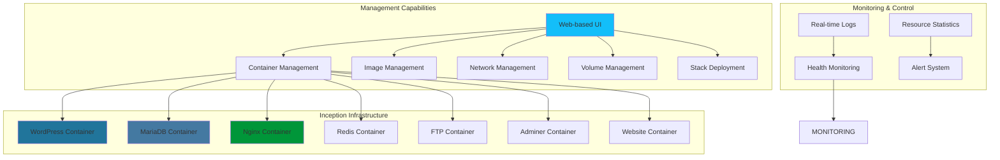
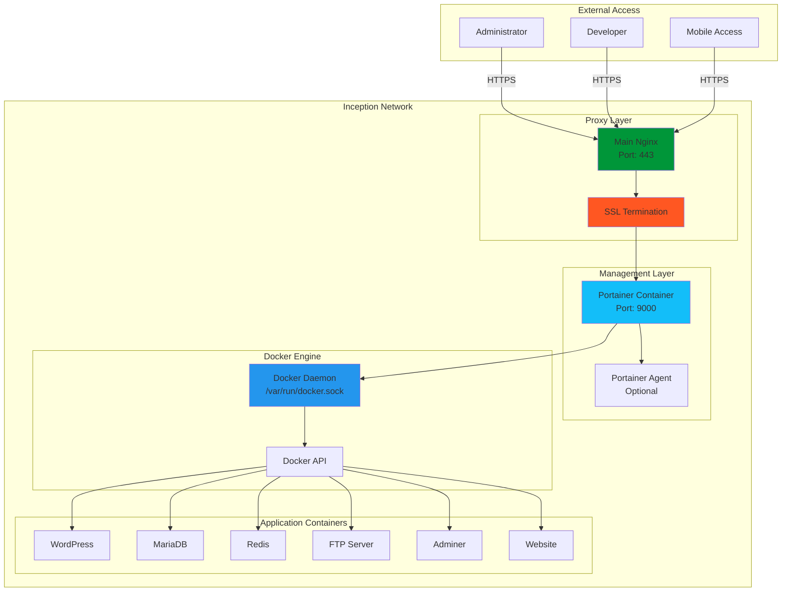
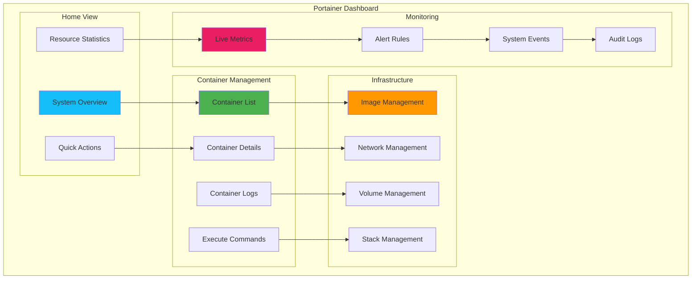

# 🐳 Portainer - Docker Management Dashboard

<div align="center">


**Container Management Made Simple**

[](https://www.portainer.io)
[](https://docker.com)
[](https://portainer.io)
[](https://alpinelinux.org)

</div>

---

## 📋 Table of Contents

- [🎯 Overview](#-overview)
- [🏗️ Architecture](#️-architecture)
- [🔧 Configuration](#-configuration)
- [🖥️ Dashboard Features](#️-dashboard-features)
- [📊 Container Management](#-container-management)
- [🔍 Monitoring & Logs](#-monitoring--logs)
- [🛡️ Security & Access](#️-security--access)
- [🚀 Advanced Features](#-advanced-features)
- [🔍 Troubleshooting](#-troubleshooting)
- [📚 Resources](#-resources)

---

## 🎯 Overview

**Portainer** provides a powerful, web-based management interface for Docker environments. In the Inception project, it serves as the central control panel for monitoring, managing, and maintaining the entire containerized infrastructure with an intuitive graphical interface.

### Why Portainer in Inception?



### Key Benefits

- **🎛️ Centralized Control**: Manage all containers from one interface
- **📊 Real-time Monitoring**: Live container statistics and health checks
- **📝 Log Management**: Centralized logging with search and filtering
- **🔒 Access Control**: User management and role-based permissions
- **⚡ Quick Actions**: Start, stop, restart containers with one click
- **💾 Resource Tracking**: CPU, memory, and network usage monitoring
- **🔧 Configuration Management**: Easy environment variable and volume management

---

## 🏗️ Architecture

### Container Structure

```
portainer/
├── 📄 Dockerfile                    # Container definition (if custom)
├── 📄 .dockerignore                 # Build exclusions
├── 📁 data/                         # Persistent data
│   ├── 📄 portainer.db              # Database file
│   ├── 📄 portainer.key             # TLS private key
│   ├── 📄 portainer.pub             # TLS public key
│   └── 📁 custom/                   # Custom configurations
├── 📁 config/                       # Configuration files
│   ├── 📄 config.json               # Portainer settings
│   └── 📄 flags.json                # Feature flags
├── 📁 templates/                    # Stack templates
│   ├── 📄 wordpress-stack.json      # WordPress template
│   └── 📄 monitoring-stack.json     # Monitoring template
└── 📄 README.md                     # This documentation
```

### Network Integration



### Data Architecture

```
Portainer Data Management:
/data/portainer/
├── portainer.db              ← Main database
├── tls/                      ← TLS certificates
│   ├── portainer.crt
│   └── portainer.key
├── compose/                  ← Stack definitions
│   ├── inception-stack.yml
│   └── monitoring-stack.yml
├── docker_config/            ← Docker configurations
│   └── config.json
└── backups/                  ← Automated backups
    ├── 2025-01-08/
    └── 2025-01-07/
```

---

## 🔧 Configuration

### Docker Compose Integration

```yaml
# Portainer service in docker-compose.yml
portainer:
  image: portainer/portainer-ce:latest
  container_name: portainer
  restart: always
  volumes:
    - /var/run/docker.sock:/var/run/docker.sock
    - portainer_data:/data
  ports:
    - "9000:9000"
    - "9443:9443"
  environment:
    - PORTAINER_ADMIN_PASSWORD_FILE=/tmp/portainer_password
  secrets:
    - portainer_password
  networks:
    - inception_network
  command: --admin-password-file /tmp/portainer_password --ssl --sslcert /data/portainer.crt --sslkey /data/portainer.key
  healthcheck:
    test: ["CMD", "curl", "-f", "http://localhost:9000/api/status"]
    interval: 30s
    timeout: 10s
    retries: 3
    start_period: 40s

secrets:
  portainer_password:
    file: ./secrets/portainer_password.txt

volumes:
  portainer_data:
    driver: local
```

### Environment Variables

| Variable | Description | Default Value |
|----------|-------------|---------------|
| `PORTAINER_ADMIN_PASSWORD` | Admin password | From secrets |
| `PORTAINER_HOST` | Hostname | `portainer` |
| `PORTAINER_PORT` | HTTP port | `9000` |
| `PORTAINER_SSL_PORT` | HTTPS port | `9443` |
| `PORTAINER_DATA` | Data directory | `/data` |
| `DOCKER_HOST` | Docker socket | `unix:///var/run/docker.sock` |
| `PORTAINER_LOG_LEVEL` | Log level | `INFO` |

### Initial Setup Script

```bash
#!/bin/bash
# portainer-setup.sh

set -e

echo "Setting up Portainer for Inception..."

# Generate admin password if not exists
if [ ! -f "secrets/portainer_password.txt" ]; then
    echo "Generating Portainer admin password..."
    mkdir -p secrets
    openssl rand -base64 32 > secrets/portainer_password.txt
    chmod 600 secrets/portainer_password.txt
    echo "✅ Password generated: $(cat secrets/portainer_password.txt)"
fi

# Generate SSL certificates
if [ ! -f "data/portainer/portainer.crt" ]; then
    echo "Generating SSL certificates for Portainer..."
    mkdir -p data/portainer/tls
    
    openssl req -x509 -nodes -days 365 \
        -newkey rsa:2048 \
        -keyout data/portainer/portainer.key \
        -out data/portainer/portainer.crt \
        -subj "/C=ES/ST=Andalucia/L=Malaga/O=42School/CN=portainer.inception.local"
    
    chmod 600 data/portainer/portainer.key
    chmod 644 data/portainer/portainer.crt
    echo "✅ SSL certificates generated"
fi

# Create initial configuration
cat > data/portainer/config.json << EOF
{
    "authentication": {
        "method": "internal"
    },
    "features": {
        "external_contributors": false
    },
    "edge": {
        "checkin_interval": 5
    },
    "templates_url": "https://raw.githubusercontent.com/portainer/templates/master/templates.json"
}
EOF

echo "✅ Portainer setup complete"
echo "Access URL: https://inception.local:9443"
echo "Admin password: $(cat secrets/portainer_password.txt)"
```

---

## 🖥️ Dashboard Features

### Main Dashboard Overview



### Key Dashboard Sections

#### 1. System Overview
- **Container Status**: Running, stopped, paused containers
- **Resource Usage**: CPU, memory, network, storage
- **System Info**: Docker version, OS, hardware specs
- **Recent Activity**: Container events and actions

#### 2. Container Management
- **List View**: All containers with status indicators
- **Quick Actions**: Start, stop, restart, delete
- **Bulk Operations**: Select multiple containers
- **Container Details**: Configuration, environment, volumes

#### 3. Real-time Monitoring
- **Live Statistics**: CPU, memory usage graphs
- **Network Traffic**: Incoming/outgoing bandwidth
- **Log Streaming**: Real-time container logs
- **Health Checks**: Container health status

### Custom Inception Dashboard

```javascript
// Custom dashboard configuration for Inception
const InceptionDashboard = {
    containers: [
        {
            name: 'nginx',
            displayName: 'Web Server',
            icon: '🌍',
            criticalityLevel: 'high',
            healthEndpoint: '/health',
            expectedStatus: 'running'
        },
        {
            name: 'wordpress',
            displayName: 'CMS',
            icon: '🌐',
            criticalityLevel: 'high',
            healthEndpoint: '/wp-admin/admin-ajax.php',
            expectedStatus: 'running'
        },
        {
            name: 'mariadb',
            displayName: 'Database',
            icon: '🗄️',
            criticalityLevel: 'critical',
            healthEndpoint: null,
            expectedStatus: 'running'
        },
        {
            name: 'redis',
            displayName: 'Cache',
            icon: '⚡',
            criticalityLevel: 'medium',
            healthEndpoint: null,
            expectedStatus: 'running'
        }
    ],
    
    monitoring: {
        refreshInterval: 5000,
        alertThresholds: {
            cpu: 80,
            memory: 85,
            disk: 90
        }
    },
    
    quickActions: [
        {
            name: 'Restart WordPress Stack',
            command: 'docker-compose restart wordpress mariadb redis',
            confirmationRequired: true
        },
        {
            name: 'Clear Redis Cache',
            command: 'docker exec redis redis-cli flushall',
            confirmationRequired: false
        },
        {
            name: 'Backup Database',
            command: './scripts/backup-database.sh',
            confirmationRequired: false
        }
    ]
};
```

---

## 📊 Container Management

### Container Operations

#### 1. Container Lifecycle Management
```bash
# Container operations through Portainer API
# Start container
curl -X POST "https://portainer.inception.local:9443/api/endpoints/1/docker/containers/wordpress/start" \
  -H "Authorization: Bearer $PORTAINER_TOKEN"

# Stop container
curl -X POST "https://portainer.inception.local:9443/api/endpoints/1/docker/containers/wordpress/stop" \
  -H "Authorization: Bearer $PORTAINER_TOKEN"

# Restart container
curl -X POST "https://portainer.inception.local:9443/api/endpoints/1/docker/containers/wordpress/restart" \
  -H "Authorization: Bearer $PORTAINER_TOKEN"

# Get container stats
curl -X GET "https://portainer.inception.local:9443/api/endpoints/1/docker/containers/wordpress/stats?stream=false" \
  -H "Authorization: Bearer $PORTAINER_TOKEN"
```

#### 2. Configuration Management
```json
{
  "container_configuration": {
    "wordpress": {
      "environment_variables": {
        "WORDPRESS_DB_HOST": "mariadb:3306",
        "WORDPRESS_DB_NAME": "wordpress_db",
        "WORDPRESS_DB_USER": "wp_user",
        "REDIS_HOST": "redis:6379"
      },
      "volumes": [
        "wordpress_data:/var/www/html",
        "wordpress_config:/var/www/html/wp-config.php"
      ],
      "networks": [
        "inception_network"
      ],
      "restart_policy": "unless-stopped",
      "health_check": {
        "test": ["CMD", "curl", "-f", "http://localhost:9000/wp-admin/admin-ajax.php"],
        "interval": "30s",
        "timeout": "10s",
        "retries": 3
      }
    }
  }
}
```

### Stack Management

#### Inception Stack Template
```yaml
# inception-stack.yml - Portainer Stack Template
version: '3.8'

services:
  nginx:
    image: nginx:alpine
    container_name: nginx
    ports:
      - "443:443"
      - "80:80"
    volumes:
      - wordpress_data:/var/www/html
      - nginx_config:/etc/nginx
    networks:
      - inception_network
    depends_on:
      - wordpress
    restart: unless-stopped

  wordpress:
    build: 
      context: ./requirements/wordpress
      dockerfile: Dockerfile
    container_name: wordpress
    volumes:
      - wordpress_data:/var/www/html
    networks:
      - inception_network
    depends_on:
      - mariadb
      - redis
    restart: unless-stopped

  mariadb:
    build:
      context: ./requirements/mariadb
      dockerfile: Dockerfile
    container_name: mariadb
    volumes:
      - mariadb_data:/var/lib/mysql
    networks:
      - inception_network
    restart: unless-stopped

  redis:
    build:
      context: ./requirements/bonus/redis
      dockerfile: Dockerfile
    container_name: redis
    volumes:
      - redis_data:/data
    networks:
      - inception_network
    restart: unless-stopped

volumes:
  wordpress_data:
  mariadb_data:
  redis_data:
  nginx_config:

networks:
  inception_network:
    driver: bridge
```

---

## 🔍 Monitoring & Logs

### Real-time Monitoring Setup

```javascript
// Portainer monitoring integration
class PortainerMonitoring {
    constructor() {
        this.apiEndpoint = 'https://portainer.inception.local:9443/api';
        this.token = localStorage.getItem('portainer_token');
        this.initializeMonitoring();
    }
    
    async initializeMonitoring() {
        // Start monitoring loops
        this.monitorContainers();
        this.monitorResources();
        this.monitorLogs();
    }
    
    async monitorContainers() {
        setInterval(async () => {
            try {
                const containers = await this.getContainers();
                this.updateContainerStatus(containers);
                this.checkContainerHealth(containers);
            } catch (error) {
                console.error('Container monitoring error:', error);
            }
        }, 5000);
    }
    
    async getContainers() {
        const response = await fetch(`${this.apiEndpoint}/endpoints/1/docker/containers/json?all=true`, {
            headers: {
                'Authorization': `Bearer ${this.token}`
            }
        });
        return response.json();
    }
    
    updateContainerStatus(containers) {
        const statusMap = {
            'running': '🟢',
            'exited': '🔴',
            'paused': '🟡',
            'restarting': '🟠'
        };
        
        containers.forEach(container => {
            const status = container.State;
            const name = container.Names[0].replace('/', '');
            const element = document.getElementById(`container-${name}`);
            
            if (element) {
                element.innerHTML = `${statusMap[status] || '⚪'} ${name}`;
                element.className = `container-status ${status}`;
            }
        });
    }
    
    async monitorResources() {
        setInterval(async () => {
            try {
                const stats = await this.getSystemStats();
                this.updateResourceGraphs(stats);
            } catch (error) {
                console.error('Resource monitoring error:', error);
            }
        }, 10000);
    }
    
    async monitorLogs() {
        // WebSocket connection for real-time logs
        const ws = new WebSocket(`wss://portainer.inception.local:9443/api/websocket/attach`);
        
        ws.onmessage = (event) => {
            const logData = JSON.parse(event.data);
            this.displayLogEntry(logData);
        };
    }
}
```

### Log Management

```bash
#!/bin/bash
# portainer-logs.sh - Enhanced log management

# Aggregate logs from all Inception containers
aggregate_inception_logs() {
    echo "=== Inception Infrastructure Logs ==="
    echo "Timestamp: $(date)"
    echo
    
    local containers=("nginx" "wordpress" "mariadb" "redis" "adminer" "ftp-server" "website" "portainer")
    
    for container in "${containers[@]}"; do
        echo "--- $container logs (last 50 lines) ---"
        docker logs --tail 50 --timestamps "$container" 2>/dev/null || echo "Container $container not found"
        echo
    done
}

# Monitor container health
monitor_container_health() {
    echo "=== Container Health Status ==="
    
    for container in $(docker ps --format "{{.Names}}"); do
        health=$(docker inspect --format='{{.State.Health.Status}}' "$container" 2>/dev/null || echo "no-health-check")
        status=$(docker inspect --format='{{.State.Status}}' "$container")
        
        case $health in
            "healthy") icon="✅" ;;
            "unhealthy") icon="❌" ;;
            "starting") icon="🟡" ;;
            *) icon="⚪" ;;
        esac
        
        echo "$icon $container: $status ($health)"
    done
}

# Performance metrics
collect_performance_metrics() {
    echo "=== Performance Metrics ==="
    
    # Overall system resources
    echo "System Resources:"
    docker system df
    echo
    
    # Container resource usage
    echo "Container Resource Usage:"
    docker stats --no-stream --format "table {{.Container}}\t{{.CPUPerc}}\t{{.MemUsage}}\t{{.MemPerc}}\t{{.NetIO}}\t{{.BlockIO}}"
}

# Generate comprehensive report
generate_monitoring_report() {
    local report_file="monitoring_report_$(date +%Y%m%d_%H%M%S).txt"
    
    {
        echo "INCEPTION INFRASTRUCTURE MONITORING REPORT"
        echo "==========================================="
        echo
        
        aggregate_inception_logs
        echo
        monitor_container_health
        echo
        collect_performance_metrics
        
    } > "$report_file"
    
    echo "✅ Monitoring report generated: $report_file"
}

# Execute monitoring
case "${1:-help}" in
    "logs") aggregate_inception_logs ;;
    "health") monitor_container_health ;;
    "metrics") collect_performance_metrics ;;
    "report") generate_monitoring_report ;;
    *) 
        echo "Usage: $0 {logs|health|metrics|report}"
        echo "  logs    - Show aggregated container logs"
        echo "  health  - Check container health status"  
        echo "  metrics - Display performance metrics"
        echo "  report  - Generate comprehensive report"
        ;;
esac
```

---

## 🛡️ Security & Access

### Authentication Configuration

```json
{
  "authentication": {
    "method": "internal",
    "ldap": {
      "enabled": false
    },
    "oauth": {
      "enabled": false
    }
  },
  "users": [
    {
      "username": "admin",
      "role": "administrator",
      "password_hash": "generated_hash"
    },
    {
      "username": "developer", 
      "role": "user",
      "password_hash": "generated_hash"
    }
  ],
  "teams": [
    {
      "name": "42-malaga",
      "members": ["admin", "developer"],
      "access": ["inception_endpoint"]
    }
  ]
}
```

### Role-Based Access Control

```bash
#!/bin/bash
# portainer-rbac.sh - Role-based access control setup

setup_portainer_users() {
    echo "Setting up Portainer users and roles..."
    
    # Admin user (full access)
    create_user "admin" "administrator" "$(cat secrets/portainer_password.txt)"
    
    # Developer user (limited access)
    create_user "developer" "user" "$(openssl rand -base64 16)"
    
    # Monitoring user (read-only)
    create_user "monitor" "user" "$(openssl rand -base64 16)"
    
    echo "✅ Users created successfully"
}

create_user() {
    local username=$1
    local role=$2
    local password=$3
    
    echo "Creating user: $username with role: $role"
    
    # Create user via Portainer API
    curl -X POST "https://portainer.inception.local:9443/api/users" \
        -H "Content-Type: application/json" \
        -H "Authorization: Bearer $PORTAINER_ADMIN_TOKEN" \
        -d "{
            \"username\": \"$username\",
            \"password\": \"$password\",
            \"role\": \"$role\"
        }"
}

setup_access_policies() {
    echo "Configuring access policies..."
    
    # Restrict developer access to specific containers
    curl -X POST "https://portainer.inception.local:9443/api/resource_controls" \
        -H "Content-Type: application/json" \
        -H "Authorization: Bearer $PORTAINER_ADMIN_TOKEN" \
        -d '{
            "type": "container",
            "resource_id": "wordpress",
            "users": [
                {"id": 2, "access_level": 2}
            ],
            "teams": [],
            "public": false
        }'
}
```

### Security Hardening

```bash
#!/bin/bash
# portainer-security.sh - Security hardening

harden_portainer_security() {
    echo "Applying Portainer security hardening..."
    
    # Generate stronger SSL certificates
    generate_ssl_certificates
    
    # Configure secure headers
    configure_security_headers
    
    # Set up authentication policies
    setup_auth_policies
    
    # Enable audit logging
    enable_audit_logging
    
    echo "✅ Security hardening complete"
}

generate_ssl_certificates() {
    echo "Generating enhanced SSL certificates..."
    
    # Create CA
    openssl genrsa -out ca.key 4096
    openssl req -new -x509 -days 365 -key ca.key -out ca.crt \
        -subj "/C=ES/ST=Andalucia/L=Malaga/O=42School/CN=Inception-CA"
    
    # Create server certificate
    openssl genrsa -out portainer.key 4096
    openssl req -new -key portainer.key -out portainer.csr \
        -subj "/C=ES/ST=Andalucia/L=Malaga/O=42School/CN=portainer.inception.local"
    
    # Sign with CA
    openssl x509 -req -days 365 -in portainer.csr -CA ca.crt -CAkey ca.key \
        -CAcreateserial -out portainer.crt
    
    # Set secure permissions
    chmod 600 *.key
    chmod 644 *.crt
    
    echo "✅ SSL certificates generated"
}

configure_security_headers() {
    # Security headers for Nginx proxy
    cat > security-headers.conf << EOF
add_header X-Frame-Options "DENY" always;
add_header X-Content-Type-Options "nosniff" always;
add_header X-XSS-Protection "1; mode=block" always;
add_header Strict-Transport-Security "max-age=31536000; includeSubDomains" always;
add_header Content-Security-Policy "default-src 'self'; script-src 'self' 'unsafe-inline'; style-src 'self' 'unsafe-inline';" always;
EOF
}
```

---

## 🚀 Advanced Features

### API Integration

```python
# portainer_api.py - Advanced Portainer automation
import requests
import json
from datetime import datetime

class PortainerAPI:
    def __init__(self, endpoint, username, password):
        self.endpoint = endpoint
        self.token = self.authenticate(username, password)
        
    def authenticate(self, username, password):
        """Authenticate and get JWT token"""
        auth_data = {
            "username": username,
            "password": password
        }
        
        response = requests.post(
            f"{self.endpoint}/api/auth",
            json=auth_data
        )
        
        if response.status_code == 200:
            return response.json()['jwt']
        else:
            raise Exception("Authentication failed")
    
    def get_containers(self, endpoint_id=1):
        """Get all containers"""
        headers = {"Authorization": f"Bearer {self.token}"}
        
        response = requests.get(
            f"{self.endpoint}/api/endpoints/{endpoint_id}/docker/containers/json?all=true",
            headers=headers
        )
        
        return response.json() if response.status_code == 200 else []
    
    def restart_inception_stack(self):
        """Restart entire Inception stack in correct order"""
        containers = self.get_containers()
        inception_containers = [
            c for c in containers 
            if c['Names'][0].replace('/', '') in [
                'mariadb', 'redis', 'wordpress', 'nginx', 
                'adminer', 'ftp-server', 'website'
            ]
        ]
        
        # Stop order (reverse dependency)
        stop_order = ['nginx', 'website', 'adminer', 'ftp-server', 'wordpress', 'redis', 'mariadb']
        
        # Start order (dependency order)
        start_order = ['mariadb', 'redis', 'wordpress', 'nginx', 'adminer', 'ftp-server', 'website']
        
        # Stop containers
        for container_name in stop_order:
            container = next((c for c in inception_containers if container_name in c['Names'][0]), None)
            if container:
                self.stop_container(container['Id'])
                print(f"✅ Stopped {container_name}")
        
        # Start containers
        for container_name in start_order:
            container = next((c for c in inception_containers if container_name in c['Names'][0]), None)
            if container:
                self.start_container(container['Id'])
                print(f"✅ Started {container_name}")
        
        print("🎯 Inception stack restart complete")
    
    def health_check_all(self):
        """Comprehensive health check"""
        containers = self.get_containers()
        results = {}
        
        for container in containers:
            name = container['Names'][0].replace('/', '')
            state = container['State']
            
            results[name] = {
                'status': state,
                'health': self.check_container_health(container['Id']),
                'uptime': self.get_container_uptime(container),
                'resource_usage': self.get_container_stats(container['Id'])
            }
        
        return results
    
    def automated_maintenance(self):
        """Automated maintenance tasks"""
        print("🔧 Starting automated maintenance...")
        
        # Clean unused images
        self.prune_images()
        
        # Clean unused volumes
        self.prune_volumes()
        
        # Clean unused networks
        self.prune_networks()
        
        # Generate health report
        health_report = self.health_check_all()
        self.save_health_report(health_report)
        
        print("✅ Automated maintenance complete")

# Usage example
if __name__ == "__main__":
    portainer = PortainerAPI(
        "https://portainer.inception.local:9443",
        "admin",
        "your_password"
    )
    
    # Automated health check
    health_results = portainer.health_check_all()
    print(json.dumps(health_results, indent=2))
    
    # Automated maintenance
    portainer.automated_maintenance()
```

### Custom Templates

```json
{
  "type": 3,
  "title": "Inception WordPress Stack",
  "description": "Complete WordPress infrastructure with MariaDB, Redis, Nginx, and additional services",
  "note": "Deploy the complete Inception project infrastructure",
  "categories": ["CMS", "Blog"],
  "platform": "linux",
  "logo": "https://portainer-io-assets.sfo2.digitaloceanspaces.com/logos/wordpress.png",
  "repository": {
    "url": "https://github.com/sternero/inception",
    "stackfile": "srcs/docker-compose.yml"
  },
  "env": [
    {
      "name": "DOMAIN_NAME",
      "label": "Domain name",
      "description": "Domain name for the WordPress site",
      "default": "inception.local"
    },
    {
      "name": "MYSQL_ROOT_PASSWORD",
      "label": "MySQL root password",
      "description": "Root password for MariaDB"
    },
    {
      "name": "MYSQL_USER",
      "label": "MySQL user",
      "description": "MySQL user for WordPress"
    },
    {
      "name": "MYSQL_PASSWORD",
      "label": "MySQL password",
      "description": "MySQL password for WordPress user"
    },
    {
      "name": "WORDPRESS_ADMIN_USER",
      "label": "WordPress admin user",
      "description": "WordPress administrator username"
    },
    {
      "name": "WORDPRESS_ADMIN_PASSWORD",
      "label": "WordPress admin password",
      "description": "WordPress administrator password"
    }
  ]
}
```

---

## 🔍 Troubleshooting

### Common Issues

#### 1. Portainer Won't Start

**Symptoms:**
```
Portainer container fails to start or crashes immediately
```

**Solutions:**
```bash
# Check container logs
docker logs portainer

# Verify Docker socket permissions
ls -la /var/run/docker.sock

# Check if port is available
netstat -tlnp | grep :9000

# Restart with fresh data (backup first!)
docker stop portainer
docker rm portainer
docker volume rm portainer_data

# Restart Portainer
docker-compose up -d portainer
```

#### 2. Cannot Access Web Interface

**Symptoms:**
```
Connection refused or timeout when accessing Portainer UI
```

**Solutions:**
```bash
# Check container status
docker ps | grep portainer

# Verify port mapping
docker port portainer

# Check firewall rules
ufw status | grep 9000

# Test local access
curl -k https://localhost:9443

# Check Nginx proxy configuration
docker exec nginx nginx -t
```

#### 3. Docker Socket Permission Denied

**Symptoms:**
```
Cannot connect to Docker daemon socket
```

**Solutions:**
```bash
# Check Docker socket permissions
ls -la /var/run/docker.sock

# Fix socket permissions
sudo chmod 666 /var/run/docker.sock

# Add user to docker group
sudo usermod -aG docker $USER

# Restart Docker service
sudo systemctl restart docker

# Verify Docker access
docker ps
```

#### 4. SSL Certificate Issues

**Symptoms:**
```
SSL certificate errors or warnings
```

**Solutions:**
```bash
# Regenerate SSL certificates
docker exec portainer sh -c "
    openssl req -x509 -nodes -days 365 \
        -newkey rsa:2048 \
        -keyout /data/portainer.key \
        -out /data/portainer.crt \
        -subj '/C=ES/ST=Andalucia/L=Malaga/O=42School/CN=portainer.inception.local'
"

# Restart Portainer
docker restart portainer

# Check certificate validity
openssl x509 -in data/portainer/portainer.crt -text -noout
```

### Debug Commands

```bash
# Portainer health check
docker exec portainer curl -f http://localhost:9000/api/status || echo "Portainer down"

# Check API accessibility
curl -k https://portainer.inception.local:9443/api/status

# Monitor Portainer logs in real-time
docker logs -f portainer

# Check Docker socket connectivity
docker exec portainer ls -la /var/run/docker.sock

# Verify container resource usage
docker stats portainer --no-stream

# Test authentication
curl -X POST https://portainer.inception.local:9443/api/auth \
  -H "Content-Type: application/json" \
  -d '{"username":"admin","password":"your_password"}' -k
```

### Performance Monitoring

```bash
#!/bin/bash
# portainer-performance.sh

echo "=== Portainer Performance Monitoring ==="

# Check response times
echo "API Response Times:"
time curl -s -k https://portainer.inception.local:9443/api/status > /dev/null

# Check resource usage
echo "Resource Usage:"
docker stats portainer --no-stream --format "table {{.Container}}\t{{.CPUPerc}}\t{{.MemUsage}}\t{{.MemPerc}}"

# Check database size
echo "Database Information:"
docker exec portainer ls -lh /data/portainer.db

# Check container count
echo "Managed Containers:"
curl -s -k https://portainer.inception.local:9443/api/endpoints/1/docker/containers/json \
  -H "Authorization: Bearer $TOKEN" | jq length

# Check system events
echo "Recent System Events:"
docker exec portainer cat /data/docker_events.log | tail -10

echo "=================================="
```

---

## 📚 Resources

### Official Documentation
- [Portainer Documentation](https://docs.portainer.io/)
- [Portainer API Reference](https://app.swaggerhub.com/apis/portainer/portainer-ce)
- [Docker Engine API](https://docs.docker.com/engine/api/)

### Installation & Configuration
- [Portainer Installation Guide](https://docs.portainer.io/start/install)
- [SSL Configuration](https://docs.portainer.io/advanced/ssl)
- [Authentication Methods](https://docs.portainer.io/admin/settings/authentication)

### Integration Resources
- [Portainer Templates](https://github.com/portainer/templates)
- [Custom Templates Guide](https://docs.portainer.io/advanced/app-templates)
- [Webhook Integration](https://docs.portainer.io/user/docker/stacks/webhooks)

### Community & Support
- [Portainer Community](https://community.portainer.io/)
- [GitHub Repository](https://github.com/portainer/portainer)
- [Docker Hub](https://hub.docker.com/r/portainer/portainer-ce)

---

<div align="center">

### 🎯 Project Integration

Portainer serves as the **central command center** for the Inception Project, providing comprehensive container management and monitoring capabilities for the entire infrastructure.

**Managed Services:**
- 🌐 [WordPress](../wordpress/README.md) - CMS container management
- 🗄️ [MariaDB](../mariadb/README.md) - Database monitoring
- 🌍 [Nginx](../nginx/README.md) - Web server control
- ⚡ [Redis](../bonus/redis/README.md) - Cache management
- 📁 [FTP-Server](../bonus/ftp-server/README.md) - File transfer monitoring
- 🗄️ [Adminer](../bonus/adminer/README.md) - Database tool oversight
- 🌐 [Website](../bonus/website/README.md) - Static site management

---

**Developed with ❤️ for 42 School**  
*sternero - 42 Málaga (2025)*

**🎉 COMPLETE - All 8 Services Documented!**

</div>
