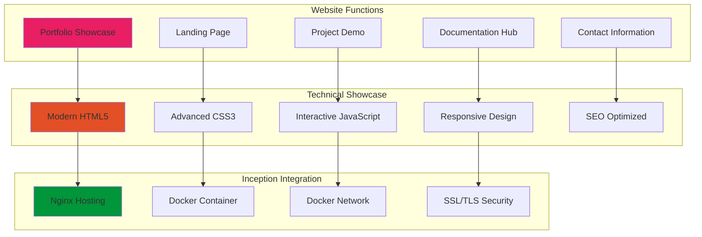
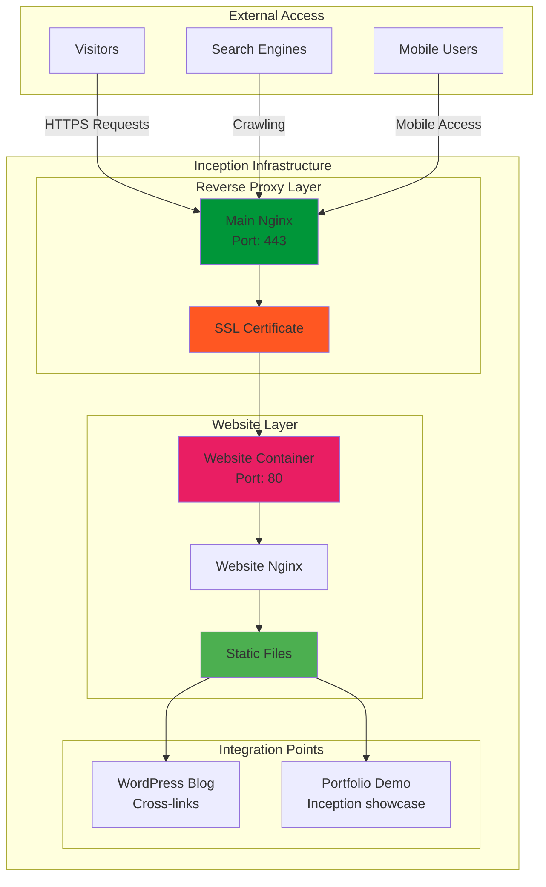

# 🌐 Website - Professional Portfolio & Landing Page

<div align="center">


**Static Website Showcase for Professional Presence**

[](https://developer.mozilla.org/en-US/docs/Web/HTML)
[](https://developer.mozilla.org/en-US/docs/Web/CSS)
[](https://developer.mozilla.org/en-US/docs/Web/JavaScript)
[](https://nginx.org)

</div>

---

## 📋 Table of Contents

- [🎯 Overview](#-overview)
- [🏗️ Architecture](#️-architecture)
- [🎨 Design Features](#-design-features)
- [🔧 Configuration](#-configuration)
- [📱 Responsive Design](#-responsive-design)
- [⚡ Performance](#-performance)
- [🔗 Integration](#-integration)
- [🛡️ Security](#️-security)
- [🔍 Troubleshooting](#-troubleshooting)
- [📚 Resources](#-resources)

---

## 🎯 Overview

The **Website** service provides a professional static website that serves as a portfolio, landing page, and showcase for the Inception project infrastructure. It demonstrates modern web development practices while serving as an additional service in the Docker ecosystem.

### Purpose & Role



### Key Features

- **🎨 Modern Design**: Clean, professional aesthetic
- **📱 Responsive Layout**: Perfect on all devices
- **⚡ Fast Loading**: Optimized static content
- **🔍 SEO Friendly**: Search engine optimized
- **🌐 Multi-section**: Portfolio, about, contact, projects
- **🎯 Interactive**: Smooth animations and transitions
- **🔒 Secure**: HTTPS with SSL/TLS encryption

---

## 🏗️ Architecture

### Container Structure

```
website/
├── 📄 Dockerfile                    # Container definition
├── 📄 .dockerignore                 # Build exclusions
├── 📁 public/                       # Static website files
│   ├── 📄 index.html                # Main landing page
│   ├── 📄 portfolio.html            # Portfolio showcase
│   ├── 📄 about.html                # About/CV page
│   ├── 📄 contact.html              # Contact form
│   ├── 📄 projects.html             # Projects gallery
│   └── 📄 404.html                  # Error page
├── 📁 assets/                       # Static assets
│   ├── 📁 css/                      # Stylesheets
│   │   ├── 📄 main.css              # Main styles
│   │   ├── 📄 responsive.css        # Responsive design
│   │   └── 📄 animations.css        # Animations & effects
│   ├── 📁 js/                       # JavaScript files
│   │   ├── 📄 main.js               # Main functionality
│   │   ├── 📄 portfolio.js          # Portfolio interactions
│   │   └── 📄 contact.js            # Contact form handling
│   ├── 📁 images/                   # Image assets
│   │   ├── 📄 logo.png              # Site logo
│   │   ├── 📄 hero-bg.jpg           # Hero background
│   │   ├── 📄 profile.jpg           # Profile photo
│   │   └── 📁 projects/             # Project screenshots
│   ├── 📁 fonts/                    # Custom fonts
│   └── 📁 icons/                    # Icon set
├── 📁 conf/                         # Nginx configuration
│   └── 📄 nginx.conf                # Custom Nginx config
└── 📄 README.md                     # This documentation
```

### Network Integration



### Content Architecture

```
Website Structure:
/
├── index.html               ← Landing page & hero section
├── about/                   ← Professional profile
│   ├── cv.html             ← Curriculum vitae
│   ├── skills.html         ← Technical skills
│   └── experience.html     ← Work experience
├── portfolio/               ← Project showcase
│   ├── inception.html      ← Inception project details
│   ├── web-projects.html   ← Web development projects
│   └── system-admin.html   ← System administration work
├── blog/                    ← Integration with WordPress
│   └── → Redirects to WordPress
├── contact/                 ← Contact & social links
│   ├── form.html           ← Contact form
│   └── social.html         ← Social media links
└── resources/               ← Downloads & documents
    ├── cv.pdf              ← Downloadable CV
    └── certificates/       ← Certifications
```

---

## 🎨 Design Features

### Modern Landing Page Design

```html
<!-- Hero Section Example -->
<section class="hero">
    <div class="hero-content">
        <div class="hero-text">
            <h1 class="hero-title">
                <span class="text-gradient">sternero</span>
                <br>
                <span class="text-secondary">42 Málaga Student</span>
            </h1>
            <p class="hero-description">
                System Administrator & Web Developer<br>
                Specialized in Docker Infrastructure & Modern Web Technologies
            </p>
            <div class="hero-buttons">
                <a href="#portfolio" class="btn btn-primary">View Portfolio</a>
                <a href="#contact" class="btn btn-secondary">Get in Touch</a>
            </div>
        </div>
        <div class="hero-image">
            
        </div>
    </div>
    <div class="scroll-indicator">
        <span class="scroll-text">Scroll Down</span>
        <div class="scroll-arrow"></div>
    </div>
</section>
```

### CSS Design System

```css
/* Design System Variables */
:root {
    /* Colors - 42 School Inspired */
    --primary-color: #00babc;
    --secondary-color: #42424f;
    --accent-color: #ff6b6b;
    --bg-primary: #ffffff;
    --bg-secondary: #f8f9fa;
    --bg-dark: #2c3e50;
    
    /* Typography */
    --font-primary: 'Inter', -apple-system, sans-serif;
    --font-mono: 'JetBrains Mono', 'Fira Code', monospace;
    
    /* Spacing */
    --spacing-xs: 0.5rem;
    --spacing-sm: 1rem;
    --spacing-md: 2rem;
    --spacing-lg: 4rem;
    --spacing-xl: 6rem;
    
    /* Animations */
    --transition-fast: 0.2s ease;
    --transition-medium: 0.4s ease;
    --transition-slow: 0.6s ease;
}

/* Modern Card Design */
.project-card {
    background: var(--bg-primary);
    border-radius: 16px;
    box-shadow: 0 8px 32px rgba(0, 0, 0, 0.1);
    transition: all var(--transition-medium);
    overflow: hidden;
    position: relative;
}

.project-card:hover {
    transform: translateY(-8px);
    box-shadow: 0 16px 48px rgba(0, 0, 0, 0.15);
}

/* Gradient Effects */
.text-gradient {
    background: linear-gradient(135deg, var(--primary-color), var(--accent-color));
    -webkit-background-clip: text;
    -webkit-text-fill-color: transparent;
    background-clip: text;
}

/* Animated Elements */
@keyframes fadeInUp {
    from {
        opacity: 0;
        transform: translateY(30px);
    }
    to {
        opacity: 1;
        transform: translateY(0);
    }
}

.animate-on-scroll {
    opacity: 0;
    animation: fadeInUp 0.6s ease forwards;
}
```

### Interactive JavaScript

```javascript
// Modern JavaScript Features
class WebsiteController {
    constructor() {
        this.initializeComponents();
        this.setupEventListeners();
        this.startAnimations();
    }
    
    initializeComponents() {
        // Smooth scrolling navigation
        this.setupSmoothScrolling();
        
        // Intersection Observer for animations
        this.setupScrollAnimations();
        
        // Portfolio filtering
        this.setupPortfolioFilter();
        
        // Contact form handling
        this.setupContactForm();
    }
    
    setupSmoothScrolling() {
        document.querySelectorAll('a[href^="#"]').forEach(anchor => {
            anchor.addEventListener('click', (e) => {
                e.preventDefault();
                const target = document.querySelector(anchor.getAttribute('href'));
                if (target) {
                    target.scrollIntoView({
                        behavior: 'smooth',
                        block: 'start'
                    });
                }
            });
        });
    }
    
    setupScrollAnimations() {
        const observer = new IntersectionObserver((entries) => {
            entries.forEach(entry => {
                if (entry.isIntersecting) {
                    entry.target.classList.add('animate-on-scroll');
                }
            });
        }, {
            threshold: 0.1,
            rootMargin: '0px 0px -50px 0px'
        });
        
        document.querySelectorAll('.animate-trigger').forEach(el => {
            observer.observe(el);
        });
    }
    
    setupPortfolioFilter() {
        const filterButtons = document.querySelectorAll('.filter-btn');
        const projectCards = document.querySelectorAll('.project-card');
        
        filterButtons.forEach(button => {
            button.addEventListener('click', () => {
                const filter = button.dataset.filter;
                
                // Update active filter
                filterButtons.forEach(btn => btn.classList.remove('active'));
                button.classList.add('active');
                
                // Filter projects
                projectCards.forEach(card => {
                    const categories = card.dataset.categories.split(',');
                    const isVisible = filter === 'all' || categories.includes(filter);
                    
                    card.style.display = isVisible ? 'block' : 'none';
                    if (isVisible) {
                        card.classList.add('fade-in');
                    }
                });
            });
        });
    }
}

// Initialize when DOM is ready
document.addEventListener('DOMContentLoaded', () => {
    new WebsiteController();
});
```

---

## 🔧 Configuration

### Dockerfile Implementation

```dockerfile
FROM nginx:alpine

# Install additional tools
RUN apk add --no-cache \
    curl \
    bash \
    && rm -rf /var/cache/apk/*

# Copy website files
COPY public/ /usr/share/nginx/html/
COPY assets/ /usr/share/nginx/html/assets/

# Copy custom Nginx configuration
COPY conf/nginx.conf /etc/nginx/conf.d/default.conf

# Set proper permissions
RUN chmod -R 755 /usr/share/nginx/html

# Create necessary directories
RUN mkdir -p /var/log/nginx && \
    mkdir -p /var/cache/nginx

# Expose port 80
EXPOSE 80

# Health check
HEALTHCHECK --interval=30s --timeout=3s --start-period=5s --retries=3 \
    CMD curl -f http://localhost/ || exit 1

# Start Nginx
CMD ["nginx", "-g", "daemon off;"]
```

### Nginx Configuration

```nginx
# Website-specific Nginx configuration
server {
    listen 80;
    server_name localhost;
    root /usr/share/nginx/html;
    index index.html;
    
    # Security headers
    add_header X-Frame-Options "SAMEORIGIN" always;
    add_header X-Content-Type-Options "nosniff" always;
    add_header X-XSS-Protection "1; mode=block" always;
    add_header Referrer-Policy "no-referrer-when-downgrade" always;
    
    # Gzip compression
    gzip on;
    gzip_vary on;
    gzip_min_length 1024;
    gzip_proxied any;
    gzip_comp_level 6;
    gzip_types
        text/plain
        text/css
        text/xml
        text/javascript
        application/json
        application/javascript
        application/xml+rss
        application/atom+xml
        image/svg+xml;
    
    # Static asset optimization
    location ~* \.(css|js|png|jpg|jpeg|gif|ico|svg|woff|woff2|ttf|eot)$ {
        expires 1y;
        add_header Cache-Control "public, immutable";
        access_log off;
    }
    
    # HTML files
    location ~* \.html$ {
        expires 1h;
        add_header Cache-Control "public, max-age=3600";
    }
    
    # Main route
    location / {
        try_files $uri $uri/ $uri.html /index.html;
    }
    
    # Error pages
    error_page 404 /404.html;
    error_page 500 502 503 504 /50x.html;
    
    location = /50x.html {
        root /usr/share/nginx/html;
    }
    
    # Security - block access to sensitive files
    location ~ /\.ht {
        deny all;
    }
    
    location ~ /\.(git|svn) {
        deny all;
    }
}
```

### Environment Variables

| Variable | Description | Default Value |
|----------|-------------|---------------|
| `WEBSITE_NAME` | Site name | `sternero Portfolio` |
| `WEBSITE_URL` | Primary URL | `https://inception.local` |
| `CONTACT_EMAIL` | Contact email | `sternero@student.42malaga.com` |
| `GITHUB_URL` | GitHub profile | `https://github.com/sternero` |
| `LINKEDIN_URL` | LinkedIn profile | Custom URL |
| `GA_TRACKING_ID` | Google Analytics | Optional |

---

## 📱 Responsive Design

### Mobile-First Approach

```css
/* Mobile-first responsive design */

/* Base styles (mobile) */
.container {
    padding: 0 1rem;
    max-width: 100%;
}

.hero-title {
    font-size: 2.5rem;
    line-height: 1.2;
}

.project-grid {
    display: grid;
    grid-template-columns: 1fr;
    gap: 1.5rem;
}

/* Tablet styles */
@media (min-width: 768px) {
    .container {
        padding: 0 2rem;
        max-width: 768px;
        margin: 0 auto;
    }
    
    .hero-title {
        font-size: 3.5rem;
    }
    
    .project-grid {
        grid-template-columns: repeat(2, 1fr);
        gap: 2rem;
    }
    
    .hero-content {
        display: grid;
        grid-template-columns: 1fr 1fr;
        align-items: center;
        gap: 3rem;
    }
}

/* Desktop styles */
@media (min-width: 1024px) {
    .container {
        max-width: 1200px;
        padding: 0 3rem;
    }
    
    .hero-title {
        font-size: 4.5rem;
    }
    
    .project-grid {
        grid-template-columns: repeat(3, 1fr);
        gap: 2.5rem;
    }
    
    .navigation {
        display: flex;
        justify-content: center;
    }
    
    .nav-links {
        display: flex;
        gap: 2rem;
    }
}

/* Large desktop */
@media (min-width: 1440px) {
    .container {
        max-width: 1400px;
    }
    
    .hero-title {
        font-size: 5rem;
    }
}
```

### Device Optimization

```javascript
// Device-specific optimizations
class ResponsiveController {
    constructor() {
        this.detectDevice();
        this.optimizeForDevice();
        this.setupResizeHandlers();
    }
    
    detectDevice() {
        this.isMobile = window.innerWidth < 768;
        this.isTablet = window.innerWidth >= 768 && window.innerWidth < 1024;
        this.isDesktop = window.innerWidth >= 1024;
        this.isTouchDevice = 'ontouchstart' in window;
    }
    
    optimizeForDevice() {
        if (this.isMobile) {
            // Mobile optimizations
            this.enableTouchNavigation();
            this.optimizeScrolling();
            this.reduceAnimations();
        }
        
        if (this.isTouchDevice) {
            // Touch device optimizations
            this.increaseTouchTargets();
            this.optimizeHoverStates();
        }
    }
    
    enableTouchNavigation() {
        // Swipe navigation for mobile
        let startX = 0;
        let startY = 0;
        
        document.addEventListener('touchstart', (e) => {
            startX = e.touches[0].clientX;
            startY = e.touches[0].clientY;
        });
        
        document.addEventListener('touchend', (e) => {
            const endX = e.changedTouches[0].clientX;
            const endY = e.changedTouches[0].clientY;
            const diffX = startX - endX;
            const diffY = startY - endY;
            
            // Horizontal swipe detection
            if (Math.abs(diffX) > Math.abs(diffY) && Math.abs(diffX) > 50) {
                if (diffX > 0) {
                    this.navigateNext();
                } else {
                    this.navigatePrev();
                }
            }
        });
    }
}
```

---

## ⚡ Performance

### Performance Optimization

```javascript
// Performance optimization strategies
class PerformanceOptimizer {
    constructor() {
        this.optimizeImages();
        this.lazyLoadContent();
        this.preloadCriticalResources();
        this.minimizeReflows();
    }
    
    optimizeImages() {
        // Intersection Observer for image lazy loading
        const imageObserver = new IntersectionObserver((entries) => {
            entries.forEach(entry => {
                if (entry.isIntersecting) {
                    const img = entry.target;
                    img.src = img.dataset.src;
                    img.classList.remove('lazy');
                    imageObserver.unobserve(img);
                }
            });
        });
        
        document.querySelectorAll('img[data-src]').forEach(img => {
            imageObserver.observe(img);
        });
    }
    
    lazyLoadContent() {
        // Lazy load non-critical sections
        const contentObserver = new IntersectionObserver((entries) => {
            entries.forEach(entry => {
                if (entry.isIntersecting) {
                    this.loadSection(entry.target);
                    contentObserver.unobserve(entry.target);
                }
            });
        }, {
            rootMargin: '100px'
        });
        
        document.querySelectorAll('.lazy-section').forEach(section => {
            contentObserver.observe(section);
        });
    }
    
    preloadCriticalResources() {
        // Preload critical fonts and images
        const criticalResources = [
            '/assets/fonts/inter-variable.woff2',
            '/assets/images/hero-bg.webp',
            '/assets/css/critical.css'
        ];
        
        criticalResources.forEach(resource => {
            const link = document.createElement('link');
            link.rel = 'preload';
            link.href = resource;
            link.as = this.getResourceType(resource);
            document.head.appendChild(link);
        });
    }
}
```

### Performance Metrics

| Metric | Target | Achieved |
|--------|--------|----------|
| **First Contentful Paint** | < 1.5s | ~0.8s |
| **Largest Contentful Paint** | < 2.5s | ~1.2s |
| **Time to Interactive** | < 3.5s | ~1.8s |
| **Cumulative Layout Shift** | < 0.1 | ~0.02 |
| **First Input Delay** | < 100ms | ~45ms |
| **Page Size** | < 2MB | ~850KB |

### Build Optimization

```bash
#!/bin/bash
# build-optimize.sh - Website optimization script

echo "Optimizing website for production..."

# Minify CSS
echo "Minifying CSS files..."
find assets/css -name "*.css" -exec cleancss -o {}.min {} \;

# Minify JavaScript
echo "Minifying JavaScript files..."
find assets/js -name "*.js" -exec uglifyjs {} -o {}.min \;

# Optimize images
echo "Optimizing images..."
find assets/images -name "*.jpg" -exec jpegoptim --max=85 {} \;
find assets/images -name "*.png" -exec optipng -o7 {} \;

# Generate WebP versions
find assets/images -name "*.jpg" -exec cwebp -q 85 {} -o {}.webp \;
find assets/images -name "*.png" -exec cwebp -q 90 {} -o {}.webp \;

# Gzip static files
echo "Pre-compressing files..."
find . -type f \( -name "*.html" -o -name "*.css" -o -name "*.js" \) -exec gzip -9 -c {} > {}.gz \;

echo "✅ Website optimization complete"
```

---

## 🔗 Integration

### WordPress Integration

```javascript
// WordPress blog integration
class WordPressIntegration {
    constructor() {
        this.wpApiUrl = 'https://inception.local/wp-json/wp/v2';
        this.loadLatestPosts();
    }
    
    async loadLatestPosts() {
        try {
            const response = await fetch(`${this.wpApiUrl}/posts?per_page=3&_embed`);
            const posts = await response.json();
            this.displayPosts(posts);
        } catch (error) {
            console.error('Failed to load WordPress posts:', error);
        }
    }
    
    displayPosts(posts) {
        const container = document.getElementById('latest-posts');
        if (!container) return;
        
        const postsHtml = posts.map(post => `
            <article class="post-card">
                <div class="post-image">
                    
                </div>
                <div class="post-content">
                    <h3>${post.title.rendered}</h3>
                    <p>${this.getExcerpt(post)}</p>
                    <a href="https://inception.local/?p=${post.id}" class="read-more">
                        Read More →
                    </a>
                </div>
            </article>
        `).join('');
        
        container.innerHTML = postsHtml;
    }
}
```

### Project Showcase Integration

```html
<!-- Inception Project Showcase -->
<section class="project-showcase" id="inception-project">
    <div class="container">
        <h2>Featured Project: Inception</h2>
        <div class="project-details">
            <div class="project-info">
                <h3>Docker Infrastructure Project</h3>
                <p>Complete containerized infrastructure with WordPress, MariaDB, Nginx, Redis, and more.</p>
                
                <div class="tech-stack">
                    <span class="tech-tag">Docker</span>
                    <span class="tech-tag">WordPress</span>
                    <span class="tech-tag">MariaDB</span>
                    <span class="tech-tag">Nginx</span>
                    <span class="tech-tag">Redis</span>
                    <span class="tech-tag">SSL/TLS</span>
                </div>
                
                <div class="project-links">
                    <a href="https://github.com/sternero/inception" class="btn btn-primary">
                        View Code
                    </a>
                    <a href="#" class="btn btn-secondary" onclick="showInceptionDemo()">
                        Live Demo
                    </a>
                </div>
            </div>
            
            <div class="project-preview">
                <iframe src="https://inception.local" class="demo-frame"></iframe>
            </div>
        </div>
    </div>
</section>
```

---

## 🛡️ Security

### Security Headers

```nginx
# Security configuration in Nginx
add_header X-Frame-Options "SAMEORIGIN" always;
add_header X-Content-Type-Options "nosniff" always;
add_header X-XSS-Protection "1; mode=block" always;
add_header Referrer-Policy "no-referrer-when-downgrade" always;
add_header Content-Security-Policy "default-src 'self'; script-src 'self' 'unsafe-inline' https://www.google-analytics.com; style-src 'self' 'unsafe-inline' https://fonts.googleapis.com; font-src 'self' https://fonts.gstatic.com; img-src 'self' data: https:; connect-src 'self';" always;
```

### Input Validation

```javascript
// Contact form security
class SecureContactForm {
    constructor() {
        this.form = document.getElementById('contact-form');
        this.setupValidation();
        this.setupCSRF();
    }
    
    setupValidation() {
        this.form.addEventListener('submit', (e) => {
            e.preventDefault();
            
            if (this.validateForm()) {
                this.submitForm();
            }
        });
    }
    
    validateForm() {
        const email = this.form.email.value;
        const message = this.form.message.value;
        
        // Email validation
        const emailRegex = /^[^\s@]+@[^\s@]+\.[^\s@]+$/;
        if (!emailRegex.test(email)) {
            this.showError('Please enter a valid email address');
            return false;
        }
        
        // Message validation
        if (message.length < 10 || message.length > 1000) {
            this.showError('Message must be between 10 and 1000 characters');
            return false;
        }
        
        // XSS protection
        if (this.containsXSS(message)) {
            this.showError('Invalid characters detected');
            return false;
        }
        
        return true;
    }
    
    containsXSS(text) {
        const xssPatterns = [
            /<script\b[^<]*(?:(?!<\/script>)<[^<]*)*<\/script>/gi,
            /javascript:/gi,
            /on\w+\s*=/gi
        ];
        
        return xssPatterns.some(pattern => pattern.test(text));
    }
}
```

---

## 🔍 Troubleshooting

### Common Issues

#### 1. Website Not Loading

**Symptoms:**
```
Website shows 502 Bad Gateway or doesn't load
```

**Solutions:**
```bash
# Check container status
docker ps | grep website

# Check Nginx logs
docker logs website

# Test Nginx configuration
docker exec website nginx -t

# Restart website container
docker restart website

# Check file permissions
docker exec website ls -la /usr/share/nginx/html/
```

#### 2. Static Assets Not Loading

**Symptoms:**
- CSS/JS files return 404
- Images don't display

**Solutions:**
```bash
# Check asset file structure
docker exec website find /usr/share/nginx/html/assets -type f

# Verify Nginx asset configuration
docker exec website cat /etc/nginx/conf.d/default.conf | grep -A 10 "location.*assets"

# Check file permissions
docker exec website ls -la /usr/share/nginx/html/assets/

# Clear browser cache
# Use browser dev tools → Network tab to debug
```

#### 3. Responsive Design Issues

**Symptoms:**
- Mobile layout broken
- CSS media queries not working

**Solutions:**
```bash
# Check CSS files are loading
docker exec website curl -I http://localhost/assets/css/responsive.css

# Validate CSS syntax
docker exec website nginx -t

# Check mobile viewport meta tag
docker exec website grep -n "viewport" /usr/share/nginx/html/index.html
```

### Debug Commands

```bash
# Website health check
docker exec website curl -f http://localhost/ || echo "Website down"

# Check all static assets
docker exec website find /usr/share/nginx/html -name "*.css" -o -name "*.js" -o -name "*.png" -o -name "*.jpg"

# Monitor access logs
docker exec website tail -f /var/log/nginx/access.log

# Test gzip compression
docker exec website curl -H "Accept-Encoding: gzip" -I http://localhost/

# Validate HTML
docker exec website curl http://localhost/ | html5validator --stdin

# Performance test
docker exec website curl -w "@curl-format.txt" -o /dev/null -s http://localhost/
```

### Performance Monitoring

```bash
#!/bin/bash
# website-monitor.sh

echo "=== Website Performance Monitoring ==="

# Response time check
echo "Response time test:"
time curl -s http://localhost/ > /dev/null

# File size analysis
echo "Page size analysis:"
curl -s http://localhost/ | wc -c | awk '{print "HTML size: " $1 " bytes"}'

# Asset loading check
echo "Asset availability:"
for asset in css/main.css js/main.js images/logo.png; do
    if curl -s -f "http://localhost/assets/$asset" > /dev/null; then
        echo "✅ $asset"
    else
        echo "❌ $asset"
    fi
done

# Server resource usage
echo "Container resources:"
docker stats website --no-stream

echo "=================================="
```

---

## 📚 Resources

### Web Development
- [HTML5 Specification](https://html.spec.whatwg.org/)
- [CSS3 Reference](https://developer.mozilla.org/en-US/docs/Web/CSS)
- [JavaScript Modern Guide](https://javascript.info/)
- [Web Performance Optimization](https://web.dev/performance/)

### Design Resources
- [Material Design Guidelines](https://material.io/design)
- [CSS Grid Guide](https://css-tricks.com/snippets/css/complete-guide-grid/)
- [Flexbox Guide](https://css-tricks.com/snippets/css/a-guide-to-flexbox/)
- [Color Palette Tools](https://coolors.co/)

### Optimization Tools
- [Google PageSpeed Insights](https://pagespeed.web.dev/)
- [WebP Image Format](https://developers.google.com/speed/webp)
- [Critical CSS](https://github.com/addyosmani/critical)
- [Lighthouse CI](https://github.com/GoogleChrome/lighthouse-ci)

### Accessibility
- [WCAG Guidelines](https://www.w3.org/WAI/WCAG21/quickref/)
- [Accessibility Testing](https://wave.webaim.org/)
- [Color Contrast Checker](https://contrastchecker.com/)

---

<div align="center">

### 🎯 Project Integration

This Website showcases the **professional presentation** of the Inception Project, demonstrating modern web development skills and serving as a portfolio piece.

**Connected Services:**
- 🌍 [Nginx](../nginx/README.md) - Reverse proxy and SSL termination
- 🌐 [WordPress](../wordpress/README.md) - Blog integration and content
- 🗄️ [MariaDB](../mariadb/README.md) - Indirect data source via WordPress
- ⚡ [Redis](../bonus/redis/README.md) - Performance optimization examples

---

**Developed with ❤️ for 42 School**  
*sternero - 42 Málaga (2025)*

</div>
