# 🗄️ MariaDB - High-Performance Database Server

<div align="center">


**Enterprise-Grade Open Source Database**

[](https://mariadb.org)
[](https://mysql.com)
[](https://docker.com)
[](https://debian.org)

</div>

---

## 📋 Table of Contents

- [🎯 Overview](#-overview)
- [🏗️ Architecture](#️-architecture)
- [🔧 Configuration](#-configuration)
- [🗃️ Database Schema](#️-database-schema)
- [🔒 Security](#-security)
- [📊 Performance](#-performance)
- [💾 Backup & Recovery](#-backup--recovery)
- [🔍 Troubleshooting](#-troubleshooting)
- [📚 Resources](#-resources)

---

## 🎯 Overview

**MariaDB** serves as the primary database engine for the Inception infrastructure, providing robust, scalable data storage for WordPress and other applications with enterprise-grade reliability and performance.

### MariaDB in Inception

```mermaid
graph TB
    subgraph "Application Layer"
        WP[WordPress<br/>Web Application]
        ADM[Adminer<br/>DB Management]
        CLI[WP-CLI<br/>Command Line]
    end
    
    subgraph "Database Layer"
        MDB[MariaDB Server<br/>Port 3306]
        WPDB[wordpress_db<br/>Database]
        TBL[WordPress Tables<br/>Posts, Users, Options]
    end
    
    subgraph "Storage Layer"
        VOL[Persistent Volume<br/>/var/lib/mysql]
        DATA[Database Files<br/>InnoDB Storage]
    end
    
    subgraph "Management Layer"
        CONF[Configuration<br/>my.cnf]
        LOGS[Database Logs<br/>Error & Query]
        BACKUP[Backup System<br/>mysqldump]
    end
    
    WP -->|SQL Queries| MDB
    ADM -->|Admin Queries| MDB
    CLI -->|Maintenance| MDB
    MDB --> WPDB
    WPDB --> TBL
    MDB --> VOL
    VOL --> DATA
    
    style MDB fill:#003545
    style WPDB fill:#4479a1
    style VOL fill:#ff6b35
```



### Why MariaDB?

- **🚀 Performance**: Optimized for high-throughput applications
- **🔒 Security**: Advanced security features and encryption
- **🔄 Compatibility**: Drop-in replacement for MySQL
- **💰 Open Source**: No licensing fees, community-driven
- **📈 Scalability**: Handles growing data requirements

---

## 🏗️ Architecture

### Container Structure

```
mariadb/
├── 📄 Dockerfile                    # Container definition
├── 📄 .dockerignore                 # Build exclusions
├── 📁 conf/                         # Configuration files
│   ├── 📄 50-server.cnf             # Server configuration
│   ├── 📄  50-mysql-clients.cnf      # Client configuration
│   └── 📄 my.cnf                    # Main configuration
├── 📁 tools/                        # Database scripts
│   ├── 📄 mariadb.sh                # Startup script
│   ├── 📄 create_database.sql       # Database creation
│   └── 📄 init_wordpress.sql        # WordPress setup
└── 📄 README.md                     # This documentation
```

### Data Persistence

```mermaid
graph LR
    subgraph "Host System"
        HD[Host Directory<br/>./data/database]
    end
    
    subgraph "Docker Container"
        MC[MariaDB Container]
        MDP[/var/lib/mysql]
        DBF[Database Files]
    end
    
    subgraph "Database Files"
        IDB[ibdata1<br/>System Tablespace]
        IBL[ib_logfile*<br/>Transaction Logs]
        WPF[wordpress_db/<br/>Database Files]
    end
    
    HD -->|Volume Mount| MDP
    MC --> MDP
    MDP --> DBF
    DBF --> IDB
    DBF --> IBL
    DBF --> WPF
    
    style MC fill:#003545
    style HD fill:#ff6b35
    style DBF fill:#4479a1
```

---

## 🔧 Configuration

### Dockerfile Highlights

```dockerfile
FROM debian:bookworm

# Install MariaDB server
RUN apt-get update && apt-get install -y \
    mariadb-server \
    mariadb-client \
    && rm -rf /var/lib/apt/lists/*

# Copy configuration files
COPY conf/50-server.cnf /etc/mysql/mariadb.conf.d/
COPY conf/50-mysql-clients.cnf /etc/mysql/mariadb.conf.d/

# Copy initialization scripts
COPY tools/ /docker-entrypoint-initdb.d/

# Create data directory
RUN mkdir -p /var/run/mysqld
RUN chown -R mysql:mysql /var/run/mysqld
RUN chown -R mysql:mysql /var/lib/mysql

# Expose MariaDB port
EXPOSE 3306
```

### Server Configuration (`50-server.cnf`)

```ini
[mysqld]
# Basic settings
user                    = mysql
pid-file                = /var/run/mysqld/mysqld.pid
basedir                 = /usr
datadir                 = /var/lib/mysql
tmpdir                  = /tmp
lc_messages_dir         = /usr/share/mysql

# Network settings
bind-address           = 0.0.0.0
port                   = 3306
socket                 = /var/run/mysqld/mysqld.sock

# MyISAM settings
key_buffer_size        = 128M
myisam_recover_options = BACKUP,FORCE

# InnoDB settings
innodb_buffer_pool_size = 256M
innodb_log_file_size   = 64M
innodb_file_per_table  = 1
innodb_flush_method    = O_DIRECT

# Query cache
query_cache_type       = 1
query_cache_size       = 32M
query_cache_limit      = 2M

# Connection settings
max_connections        = 100
connect_timeout        = 5
wait_timeout          = 600
max_allowed_packet    = 64M
thread_cache_size     = 128
sort_buffer_size      = 4M
bulk_insert_buffer_size = 16M
tmp_table_size        = 32M
max_heap_table_size   = 32M

# Logging
log_error             = /var/log/mysql/error.log
slow_query_log        = 1
slow_query_log_file   = /var/log/mysql/slow.log
long_query_time       = 2

# Character set
character_set_server  = utf8mb4
collation_server     = utf8mb4_unicode_ci

# Security
sql_mode             = STRICT_TRANS_TABLES,ERROR_FOR_DIVISION_BY_ZERO,NO_AUTO_CREATE_USER,NO_ENGINE_SUBSTITUTION
```

### Environment Variables

| Variable | Description | Default/Example |
|----------|-------------|-----------------|
| `MYSQL_ROOT_PASSWORD` | Root user password | From `.env` |
| `MYSQL_DATABASE` | WordPress database name | `wordpress_db` |
| `MYSQL_USER` | WordPress database user | `sternero` |
| `MYSQL_PASSWORD` | User password | From `.env` |
| `MYSQL_HOST` | Database hostname | `mariadb` |

---

## 🗃️ Database Schema

### WordPress Database Structure

The MariaDB instance hosts the complete WordPress database schema:

#### Core Tables

| Table Name | Purpose | Estimated Rows |
|------------|---------|----------------|
| `wp_posts` | Content (posts, pages) | 1,000+ |
| `wp_users` | User accounts | 10-100 |
| `wp_comments` | Comment system | 5,000+ |
| `wp_options` | Site configuration | 200+ |
| `wp_postmeta` | Post metadata | 3,000+ |
| `wp_usermeta` | User metadata | 500+ |
| `wp_terms` | Categories/tags | 100+ |
| `wp_term_taxonomy` | Taxonomy definitions | 100+ |
| `wp_term_relationships` | Content-taxonomy links | 1,000+ |

#### Database Creation Script

```sql
-- create_database.sql
CREATE DATABASE IF NOT EXISTS wordpress_db 
CHARACTER SET utf8mb4 
COLLATE utf8mb4_unicode_ci;

CREATE USER IF NOT EXISTS 'sternero'@'%' 
IDENTIFIED BY '${MYSQL_PASSWORD}';

GRANT ALL PRIVILEGES ON wordpress_db.* 
TO 'sternero'@'%';

FLUSH PRIVILEGES;

-- Create indexes for performance
USE wordpress_db;

-- Performance indexes for WordPress
CREATE INDEX idx_post_name ON wp_posts(post_name);
CREATE INDEX idx_post_date ON wp_posts(post_date);
CREATE INDEX idx_comment_post_id ON wp_comments(comment_post_ID);
CREATE INDEX idx_meta_key ON wp_postmeta(meta_key);
```

### Data Analysis Queries

```sql
-- Database size analysis
SELECT 
    table_name AS 'Table',
    table_rows AS 'Rows',
    ROUND(((data_length + index_length) / 1024 / 1024), 2) AS 'Size (MB)',
    ROUND((index_length / 1024 / 1024), 2) AS 'Index Size (MB)'
FROM information_schema.TABLES 
WHERE table_schema = 'wordpress_db'
ORDER BY (data_length + index_length) DESC;

-- Content statistics
SELECT 
    post_type,
    post_status,
    COUNT(*) as count
FROM wp_posts 
GROUP BY post_type, post_status;

-- User activity analysis
SELECT 
    u.user_login,
    u.user_email,
    u.user_registered,
    COUNT(p.ID) as post_count
FROM wp_users u
LEFT JOIN wp_posts p ON u.ID = p.post_author
GROUP BY u.ID;
```

---

## 🔒 Security

### Security Configuration

#### User Management
```sql
-- Secure root user
ALTER USER 'root'@'localhost' IDENTIFIED BY '${MYSQL_ROOT_PASSWORD}';
DELETE FROM mysql.user WHERE User='';
DELETE FROM mysql.user WHERE User='root' AND Host NOT IN ('localhost', '127.0.0.1', '::1');

-- Remove test database
DROP DATABASE IF EXISTS test;
DELETE FROM mysql.db WHERE Db='test' OR Db='test\\_%';

-- Application user with minimal privileges
CREATE USER 'sternero'@'%' IDENTIFIED BY '${MYSQL_PASSWORD}';
GRANT SELECT, INSERT, UPDATE, DELETE, CREATE, DROP, INDEX, ALTER 
ON wordpress_db.* TO 'sternero'@'%';

FLUSH PRIVILEGES;
```

#### Network Security
```ini
# Bind to internal network only
bind-address = 0.0.0.0

# SSL configuration (optional)
ssl-ca = /etc/mysql/ssl/ca-cert.pem
ssl-cert = /etc/mysql/ssl/server-cert.pem
ssl-key = /etc/mysql/ssl/server-key.pem

# Disable dangerous functions
local-infile = 0
skip-show-database
```

### Security Best Practices

| Practice | Implementation | Status |
|----------|----------------|--------|
| **Strong Passwords** | Generated random passwords | ✅ |
| **Minimal Privileges** | Database-specific user rights | ✅ |
| **Network Isolation** | Docker internal network only | ✅ |
| **Data Encryption** | utf8mb4 character set | ✅ |
| **Query Logging** | Slow query log enabled | ✅ |
| **Regular Updates** | Latest MariaDB stable version | ✅ |

---

## 📊 Performance

### Performance Tuning

#### Memory Configuration
```ini
# InnoDB buffer pool (most important)
innodb_buffer_pool_size = 256M    # 70-80% of available RAM

# Query cache
query_cache_size = 32M            # For repeated SELECT queries
query_cache_type = 1              # Enable query cache

# Connection buffers
sort_buffer_size = 4M             # For ORDER BY operations
read_buffer_size = 2M             # For table scans
join_buffer_size = 2M             # For JOIN operations
```

#### InnoDB Optimization
```ini
# InnoDB specific settings
innodb_file_per_table = 1         # Separate files per table
innodb_flush_method = O_DIRECT    # Direct I/O
innodb_log_file_size = 64M        # Transaction log size
innodb_log_buffer_size = 16M      # Log buffer
innodb_flush_log_at_trx_commit = 2 # Performance vs durability
```

### Performance Monitoring

```sql
-- Connection analysis
SHOW PROCESSLIST;
SHOW STATUS LIKE 'Connections';
SHOW STATUS LIKE 'Threads_connected';

-- Query performance
SHOW STATUS LIKE 'Slow_queries';
SHOW STATUS LIKE 'Queries';
SELECT * FROM INFORMATION_SCHEMA.PROCESSLIST WHERE TIME > 5;

-- Cache efficiency
SHOW STATUS LIKE 'Qcache%';
SHOW STATUS LIKE 'Query_cache%';

-- InnoDB status
SHOW ENGINE INNODB STATUS;
```

### Performance Metrics

| Metric | Target Value | Monitoring Command |
|--------|--------------|-------------------|
| **Query Response** | <100ms | `SHOW PROCESSLIST` |
| **Cache Hit Ratio** | >95% | `SHOW STATUS LIKE 'Qcache%'` |
| **Slow Queries** | <1% | `SHOW STATUS LIKE 'Slow_queries'` |
| **Memory Usage** | <80% | `docker stats mariadb` |
| **Connections** | <80 concurrent | `SHOW STATUS LIKE 'Threads_connected'` |

---

## 💾 Backup & Recovery

### Backup Strategy

#### Automated Backup Script
```bash
#!/bin/bash
# backup_database.sh

BACKUP_DIR="/backups/$(date +%Y-%m-%d)"
MYSQL_USER="sternero"
MYSQL_PASSWORD="12345"
DATABASE="wordpress_db"

# Create backup directory
mkdir -p "$BACKUP_DIR"

# Full database backup
docker exec mariadb mysqldump \
    --user="$MYSQL_USER" \
    --password="$MYSQL_PASSWORD" \
    --single-transaction \
    --routines \
    --triggers \
    "$DATABASE" > "$BACKUP_DIR/wordpress_full.sql"

# Compress backup
gzip "$BACKUP_DIR/wordpress_full.sql"

# Keep only last 7 days
find /backups -type d -mtime +7 -exec rm -rf {} \;

echo "Backup completed: $BACKUP_DIR/wordpress_full.sql.gz"
```

#### Table-Specific Backups
```bash
# Important tables backup
for table in wp_posts wp_users wp_options; do
    docker exec mariadb mysqldump \
        --user="$MYSQL_USER" \
        --password="$MYSQL_PASSWORD" \
        wordpress_db $table > "$BACKUP_DIR/${table}.sql"
done
```

### Recovery Procedures

#### Full Database Restore
```bash
# Stop WordPress to prevent conflicts
docker stop wordpress

# Restore from backup
docker exec -i mariadb mysql \
    --user="sternero" \
    --password="12345" \
    wordpress_db < backup_file.sql

# Restart WordPress
docker start wordpress
```

#### Point-in-Time Recovery
```sql
-- Enable binary logging for point-in-time recovery
SET GLOBAL log_bin = ON;
SET GLOBAL binlog_format = 'ROW';

-- View binary logs
SHOW BINARY LOGS;
SHOW BINLOG EVENTS IN 'mysql-bin.000001';
```

---

## 🔍 Troubleshooting

### Common Issues

#### 1. Database Connection Refused

**Symptoms:**
```
Can't connect to MySQL server on 'mariadb' (111)
```

**Solutions:**
```bash
# Check container status
docker ps | grep mariadb

# Check MariaDB process
docker exec mariadb ps aux | grep mysqld

# Check network connectivity
docker exec wordpress ping mariadb

# Restart MariaDB service
docker exec mariadb systemctl restart mariadb
# or
docker restart mariadb
```

#### 2. Out of Memory Errors

**Symptoms:**
```
Out of memory (Needed X bytes)
```

**Solutions:**
```bash
# Check memory usage
docker stats mariadb

# Optimize memory settings in my.cnf
innodb_buffer_pool_size = 128M  # Reduce if needed
query_cache_size = 16M          # Reduce cache size

# Check for memory leaks
docker exec mariadb mysql -e "SHOW PROCESSLIST;"
```

#### 3. Slow Query Performance

**Symptoms:**
- WordPress loading slowly
- High CPU usage

**Solutions:**
```sql
-- Enable slow query log
SET GLOBAL slow_query_log = 'ON';
SET GLOBAL long_query_time = 1;

-- Analyze slow queries
SELECT * FROM mysql.slow_log ORDER BY start_time DESC LIMIT 10;

-- Check indexes
SHOW INDEX FROM wp_posts;
ANALYZE TABLE wp_posts;

-- Optimize tables
OPTIMIZE TABLE wp_posts, wp_comments, wp_options;
```

### Debug Commands

```bash
# MariaDB service status
docker exec mariadb systemctl status mariadb

# Check error logs
docker exec mariadb tail -f /var/log/mysql/error.log

# Test database connectivity
docker exec mariadb mysql -u sternero -p12345 -e "SELECT VERSION();"

# Database size check
docker exec mariadb mysql -u sternero -p12345 wordpress_db -e "
SELECT 
    table_name,
    ROUND(((data_length + index_length) / 1024 / 1024), 2) AS 'Size in MB'
FROM information_schema.tables
WHERE table_schema = 'wordpress_db';"

# Performance status
docker exec mariadb mysql -u sternero -p12345 -e "SHOW STATUS LIKE 'Threads_connected';"
```

### Health Monitoring

```bash
# Container health check
docker exec mariadb mysqladmin ping -u sternero -p12345

# Database integrity check
docker exec mariadb mysqlcheck -u sternero -p12345 --all-databases

# Monitor active connections
watch -n 1 'docker exec mariadb mysql -u sternero -p12345 -e "SHOW PROCESSLIST;"'
```

---

## 📚 Resources

### Official Documentation
- [MariaDB Official Documentation](https://mariadb.org/documentation/)
- [MariaDB Knowledge Base](https://mariadb.com/kb/en/)
- [MySQL Compatibility](https://mariadb.com/kb/en/mariadb-vs-mysql-compatibility/)

### Performance & Optimization
- [MariaDB Performance Tuning](https://mariadb.com/kb/en/optimization-and-tuning/)
- [InnoDB Optimization](https://mariadb.com/kb/en/innodb-system-variables/)
- [Query Optimization](https://mariadb.com/kb/en/query-optimizations/)

### Security Resources
- [MariaDB Security](https://mariadb.com/kb/en/securing-mariadb/)
- [User Account Management](https://mariadb.com/kb/en/user-account-management/)
- [SSL/TLS Configuration](https://mariadb.com/kb/en/secure-connections-overview/)

### Backup & Recovery
- [MariaDB Backup Methods](https://mariadb.com/kb/en/backup-and-restore-overview/)
- [mysqldump Documentation](https://mariadb.com/kb/en/mysqldump/)
- [Point-in-Time Recovery](https://mariadb.com/kb/en/point-in-time-recovery/)

---

<div align="center">

### 🎯 Project Integration

This MariaDB service is the **data foundation** of the Inception Project, providing reliable, high-performance database services for all applications.

**Connected Services:**
- 🌐 [WordPress](../wordpress/README.md) - Primary application database
- 🗄️ [Adminer](../bonus/adminer/README.md) - Database administration
- 🌍 [Nginx](../nginx/README.md) - Web server (indirect connection)
- ⚡ [Redis](../bonus/redis/README.md) - Caching layer complement

---

**Developed with ❤️ for 42 School**  
*sternero - 42 Málaga (2025)*

</div>
