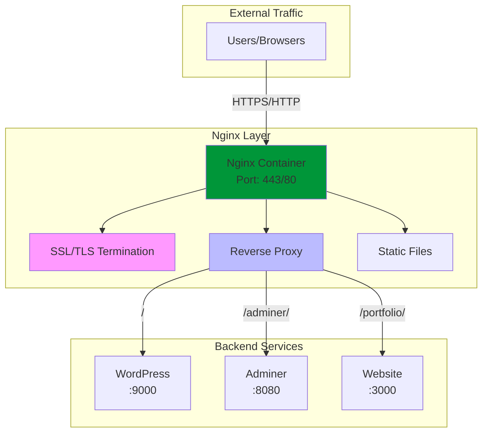
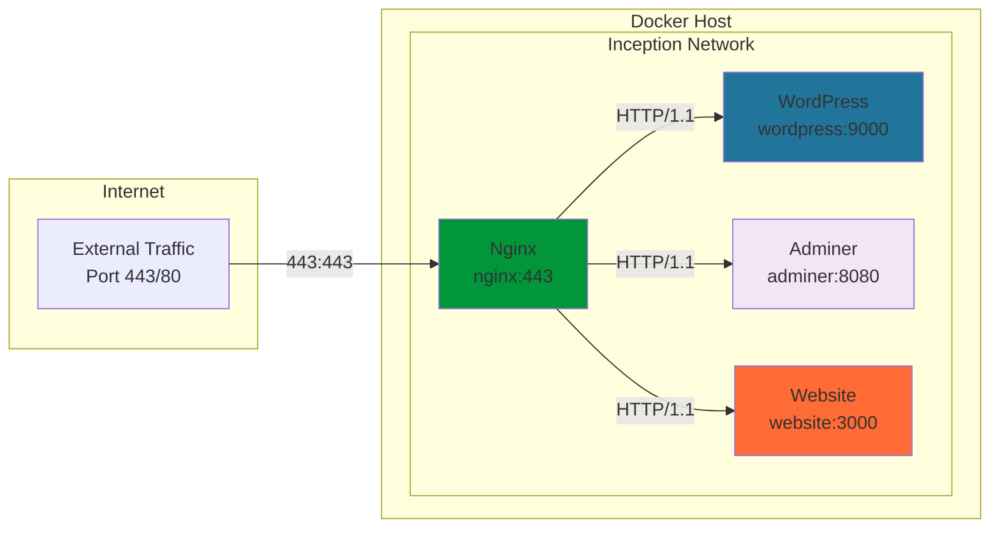

# 🌍 Nginx - High-Performance Web Server & Reverse Proxy

<div align="center">


**Enterprise-Grade Web Server & Load Balancer**

[](https://nginx.org)
[](https://letsencrypt.org)
[](https://docker.com)
[](https://alpinelinux.org)

</div>

---

## 📋 Table of Contents

- [🎯 Overview](#-overview)
- [🏗️ Architecture](#️-architecture)
- [🔧 Configuration](#-configuration)
- [🔒 SSL/TLS Setup](#-ssltls-setup)
- [🌐 Reverse Proxy](#-reverse-proxy)
- [📊 Performance](#-performance)
- [🛡️ Security](#️-security)
- [🔍 Troubleshooting](#-troubleshooting)
- [📚 Resources](#-resources)

---

## 🎯 Overview

**Nginx** serves as the entry point and traffic director for the entire Inception infrastructure. It acts as a reverse proxy, SSL terminator, and static file server, providing enterprise-grade web serving capabilities.

### Core Responsibilities



### Why Nginx in Inception?

- **🚀 High Performance**: Handles thousands of concurrent connections
- **🔒 Security**: SSL/TLS termination and security headers
- **📍 Routing**: Intelligent request routing to backend services
- **📁 Static Files**: Efficient static content delivery
- **🛡️ Protection**: Rate limiting and DDoS protection

---

## 🏗️ Architecture

### Container Structure

```
nginx/
├── 📄 Dockerfile                    # Container definition
├── 📄 .dockerignore                 # Build exclusions
├── 📁 conf/                         # Configuration files
│   ├── 📄 nginx.conf                # Main Nginx configuration
│   ├── 📄 default.conf              # Virtual host configuration
│   └── 📄 ssl.conf                  # SSL/TLS settings
├── 📁 ssl/                          # SSL certificates
│   ├── 📄 nginx.crt                 # SSL certificate
│   └── 📄 nginx.key                 # Private key
└── 📄 README.md                     # This documentation
```

### Network Integration



---

## 🔧 Configuration

### Dockerfile Highlights

```dockerfile
FROM nginx:1.24-alpine

# Copy configuration files
COPY conf/nginx.conf /etc/nginx/nginx.conf
COPY conf/default.conf /etc/nginx/conf.d/default.conf
COPY conf/ssl.conf /etc/nginx/conf.d/ssl.conf

# Copy SSL certificates
COPY ssl/ /etc/nginx/ssl/

# Expose HTTPS port
EXPOSE 443
```

### Main Configuration (`nginx.conf`)

```nginx
# High-performance configuration
worker_processes auto;
worker_rlimit_nofile 65535;

events {
    worker_connections 1024;
    use epoll;
    multi_accept on;
}

http {
    # Performance optimizations
    sendfile on;
    tcp_nopush on;
    tcp_nodelay on;
    keepalive_timeout 65;
    
    # Security headers
    add_header X-Frame-Options "SAMEORIGIN" always;
    add_header X-Content-Type-Options "nosniff" always;
    add_header X-XSS-Protection "1; mode=block" always;
    
    # Include virtual hosts
    include /etc/nginx/conf.d/*.conf;
}
```

### Virtual Host Configuration (`default.conf`)

```nginx
server {
    listen 443 ssl http2;
    server_name ${DOMAIN_NAME};
    
    # SSL Configuration
    ssl_certificate /etc/nginx/ssl/nginx.crt;
    ssl_certificate_key /etc/nginx/ssl/nginx.key;
    ssl_protocols TLSv1.2 TLSv1.3;
    ssl_ciphers ECDHE-RSA-AES256-GCM-SHA512:DHE-RSA-AES256-GCM-SHA512;
    
    # Root location - WordPress
    location / {
        proxy_pass http://wordpress:9000;
        proxy_set_header Host $host;
        proxy_set_header X-Real-IP $remote_addr;
        proxy_set_header X-Forwarded-For $proxy_add_x_forwarded_for;
        proxy_set_header X-Forwarded-Proto $scheme;
    }
    
    # Adminer database management
    location /adminer/ {
        proxy_pass http://adminer:8080/;
        proxy_set_header Host $host;
        proxy_set_header X-Real-IP $remote_addr;
    }
    
    # Static portfolio website
    location /portfolio/ {
        proxy_pass http://website:3000/;
        proxy_set_header Host $host;
        proxy_set_header X-Real-IP $remote_addr;
    }
}
```

---

## 🔒 SSL/TLS Setup

### Certificate Generation

The project uses self-signed certificates for development:

```bash
# Generate private key
openssl genrsa -out nginx.key 4096

# Generate certificate signing request
openssl req -new -key nginx.key -out nginx.csr \
    -subj "/C=ES/ST=Andalusia/L=Malaga/O=42School/CN=${DOMAIN_NAME}"

# Generate self-signed certificate
openssl x509 -req -days 365 -in nginx.csr -signkey nginx.key -out nginx.crt
```

### SSL Configuration Details

| Setting | Value | Purpose |
|---------|-------|---------|
| **Protocols** | TLSv1.2, TLSv1.3 | Modern security standards |
| **Ciphers** | ECDHE-RSA-AES256-GCM-SHA512 | Strong encryption |
| **Key Size** | 4096 bits | Enhanced security |
| **Validity** | 365 days | Development lifecycle |

### Security Headers

```nginx
# Security headers implementation
add_header Strict-Transport-Security "max-age=31536000; includeSubDomains" always;
add_header X-Frame-Options "SAMEORIGIN" always;
add_header X-Content-Type-Options "nosniff" always;
add_header X-XSS-Protection "1; mode=block" always;
add_header Referrer-Policy "strict-origin-when-cross-origin" always;
```

---

## 🌐 Reverse Proxy

### Routing Logic

```
┌─────────────────────────────────────────────────────────┐
│                    Nginx Routing                        │
├─────────────────────────────────────────────────────────┤
│                                                         │
│  https://domain/           ──►  WordPress (Port 9000)   │
│  https://domain/wp-admin/  ──►  WordPress (Port 9000)   │
│  https://domain/adminer/   ──►  Adminer  (Port 8080)    │
│  https://domain/portfolio/ ──►  Website  (Port 3000)    │
│                                                         │
└─────────────────────────────────────────────────────────┘
```

### Load Balancing Configuration

```nginx
# For high-availability setups
upstream wordpress_backend {
    server wordpress:9000 weight=1 max_fails=3 fail_timeout=30s;
    # Additional WordPress instances can be added here
}

upstream adminer_backend {
    server adminer:8080 weight=1 max_fails=3 fail_timeout=30s;
}
```

### Proxy Headers

```nginx
# Standard proxy headers
proxy_set_header Host $host;
proxy_set_header X-Real-IP $remote_addr;
proxy_set_header X-Forwarded-For $proxy_add_x_forwarded_for;
proxy_set_header X-Forwarded-Proto $scheme;
proxy_set_header X-Forwarded-Host $server_name;

# WebSocket support (if needed)
proxy_set_header Upgrade $http_upgrade;
proxy_set_header Connection "upgrade";
```

---

## 📊 Performance

### Optimization Settings

```nginx
# Worker process optimization
worker_processes auto;
worker_rlimit_nofile 65535;

# Event handling
events {
    worker_connections 1024;
    use epoll;
    multi_accept on;
}

# HTTP optimizations
http {
    sendfile on;
    tcp_nopush on;
    tcp_nodelay on;
    keepalive_timeout 65;
    types_hash_max_size 2048;
    
    # Compression
    gzip on;
    gzip_vary on;
    gzip_min_length 1024;
    gzip_types text/plain text/css application/json application/javascript;
}
```

### Caching Strategy

```nginx
# Static file caching
location ~* \.(jpg|jpeg|png|gif|ico|css|js)$ {
    expires 1M;
    add_header Cache-Control "public, immutable";
    access_log off;
}

# Browser caching for HTML
location ~* \.html$ {
    expires 1h;
    add_header Cache-Control "public";
}
```

### Performance Metrics

| Metric | Expected Value | Monitoring |
|--------|----------------|------------|
| **Requests/sec** | 1000+ | `nginx -s reload` |
| **Response Time** | <100ms | Access logs |
| **Memory Usage** | <50MB | `docker stats nginx` |
| **CPU Usage** | <5% | `docker stats nginx` |

---

## 🛡️ Security

### Security Measures

#### 1. SSL/TLS Configuration
```nginx
# Modern SSL configuration
ssl_protocols TLSv1.2 TLSv1.3;
ssl_prefer_server_ciphers off;
ssl_ciphers ECDHE-ECDSA-AES128-GCM-SHA256:ECDHE-RSA-AES128-GCM-SHA256;
ssl_session_timeout 1d;
ssl_session_cache shared:SSL:50m;
ssl_stapling on;
ssl_stapling_verify on;
```

#### 2. Rate Limiting
```nginx
# Prevent DDoS attacks
limit_req_zone $binary_remote_addr zone=login:10m rate=1r/s;
limit_req_zone $binary_remote_addr zone=api:10m rate=10r/s;

# Apply rate limiting
location /wp-login.php {
    limit_req zone=login burst=5;
}

location /wp-admin/ {
    limit_req zone=api burst=10;
}
```

#### 3. Security Headers
```nginx
# Comprehensive security headers
add_header Strict-Transport-Security "max-age=63072000; includeSubDomains; preload";
add_header X-Frame-Options "SAMEORIGIN";
add_header X-Content-Type-Options "nosniff";
add_header X-XSS-Protection "1; mode=block";
add_header Referrer-Policy "strict-origin-when-cross-origin";
add_header Content-Security-Policy "default-src 'self'; script-src 'self' 'unsafe-inline'";
```

### Production Security Checklist

- ✅ **SSL/TLS**: Strong ciphers and protocols
- ✅ **Headers**: Security headers implemented
- ✅ **Rate Limiting**: DDoS protection active
- ✅ **Access Control**: IP whitelisting available
- ✅ **Logging**: Comprehensive access/error logs
- ⚠️ **Certificates**: Replace self-signed in production

---

## 🔍 Troubleshooting

### Common Issues

#### 1. SSL Certificate Errors

**Symptoms:**
```
SSL_ERROR_SELF_SIGNED_CERT in browser
```

**Solutions:**
```bash
# Check certificate validity
openssl x509 -in /path/to/nginx.crt -text -noout

# Verify certificate matches domain
openssl x509 -in nginx.crt -noout -subject

# Test SSL configuration
docker exec nginx nginx -t
```

#### 2. Proxy Connection Failed

**Symptoms:**
```
502 Bad Gateway
upstream connect error
```

**Solutions:**
```bash
# Check backend service status
docker ps | grep -E "(wordpress|adminer|website)"

# Test backend connectivity
docker exec nginx curl -f http://wordpress:9000/
docker exec nginx curl -f http://adminer:8080/

# Check network connectivity
docker network ls
docker network inspect inception_network
```

#### 3. High Memory Usage

**Symptoms:**
- Nginx container using excessive memory

**Solutions:**
```bash
# Monitor resource usage
docker stats nginx

# Check worker processes
docker exec nginx ps aux | grep nginx

# Optimize configuration
# Reduce worker_connections if needed
worker_connections 512;
```

### Debug Commands

```bash
# Test Nginx configuration
docker exec nginx nginx -t

# Reload configuration
docker exec nginx nginx -s reload

# Check access logs
docker exec nginx tail -f /var/log/nginx/access.log

# Check error logs
docker exec nginx tail -f /var/log/nginx/error.log

# Test SSL certificate
echo | openssl s_client -connect localhost:443 -servername domain.com
```

### Log Analysis

```bash
# Real-time access monitoring
docker exec nginx tail -f /var/log/nginx/access.log | grep -E "(404|500|502)"

# Error pattern analysis
docker exec nginx grep "upstream" /var/log/nginx/error.log

# Performance analysis
docker exec nginx awk '{print $9}' /var/log/nginx/access.log | sort | uniq -c | sort -nr
```

---

## 📚 Resources

### Official Documentation
- [Nginx Official Documentation](https://nginx.org/en/docs/)
- [Nginx Configuration Guide](https://nginx.org/en/docs/beginners_guide.html)
- [SSL/TLS Best Practices](https://nginx.org/en/docs/http/configuring_https_servers.html)

### Docker & Containerization
- [Nginx Docker Hub](https://hub.docker.com/_/nginx)
- [Docker Networking](https://docs.docker.com/network/)

### Security Resources
- [Mozilla SSL Configuration Generator](https://ssl-config.mozilla.org/)
- [OWASP Security Headers](https://owasp.org/www-project-secure-headers/)
- [SSL Labs Server Test](https://www.ssllabs.com/ssltest/)

### Performance Optimization
- [Nginx Performance Tuning](https://nginx.org/en/docs/http/ngx_http_core_module.html)
- [HTTP/2 Configuration](https://nginx.org/en/docs/http/ngx_http_v2_module.html)

---

<div align="center">

### 🎯 Project Integration

This Nginx service is the **front door** of the Inception Project, routing traffic to all backend services with enterprise-grade security and performance.

**Connected Services:**
- 🌐 [WordPress](../wordpress/README.md) - Content Management System
- 🗄️ [Adminer](../bonus/adminer/README.md) - Database Management
- 👤 [Website](../bonus/website/README.md) - Static Portfolio
- 🗄️ [MariaDB](../mariadb/README.md) - Database Server (indirect)

---

**Developed with ❤️ for 42 School**  
*sternero - 42 Málaga (2025)*

</div>
