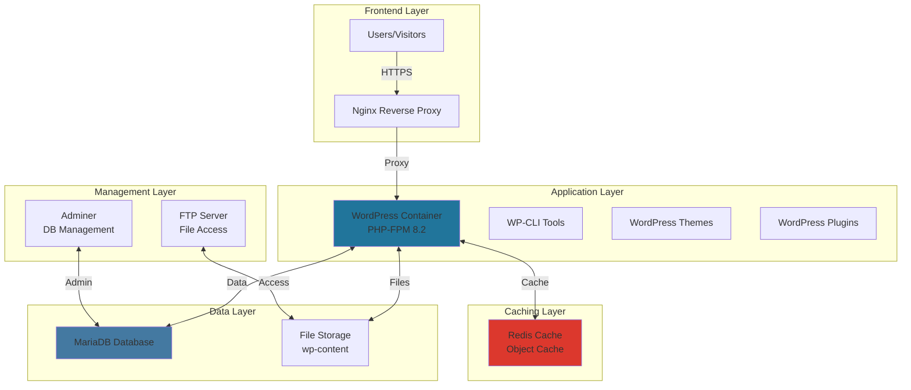
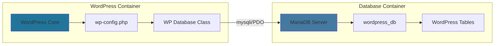
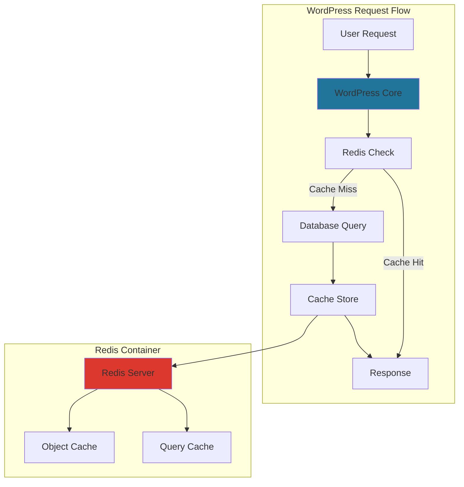

# 🌐 WordPress - Professional Content Management System

<div align="center">


**The World's Most Popular CMS**

[](https://wordpress.org)
[](https://php.net)
[](https://mysql.com)
[](https://redis.io)

</div>

---

## 📋 Table of Contents

- [🎯 Overview](#-overview)
- [🏗️ Architecture](#️-architecture)
- [🔧 Configuration](#-configuration)
- [🔗 Database Integration](#-database-integration)
- [⚡ Redis Caching](#-redis-caching)
- [👥 User Management](#-user-management)
- [📁 File Management](#-file-management)
- [🛡️ Security](#️-security)
- [🔍 Troubleshooting](#-troubleshooting)
- [📚 Resources](#-resources)

---

## 🎯 Overview

**WordPress** serves as the core content management system in the Inception infrastructure, providing a full-featured website platform with advanced caching, database integration, and user management capabilities.

### WordPress in Inception Architecture



### Key Features

- **🌐 Content Management**: Full CMS capabilities with themes and plugins
- **👥 Multi-User Support**: Admin and regular user accounts
- **⚡ Performance**: Redis object caching for enhanced speed
- **🔒 Security**: Secure configuration and user management
- **📱 Responsive**: Mobile-friendly themes and interface
- **🔧 Customizable**: Extensive plugin and theme ecosystem

---

## 🏗️ Architecture

### Container Structure

```
wordpress/
├── 📄 Dockerfile                    # Container definition
├── 📄 .dockerignore                 # Build exclusions
├── 📁 conf/                         # Configuration files
│   ├── 📄 wp-config.php             # WordPress configuration
│   ├── 📄 php.ini                   # PHP optimization
│   ├── 📄 www.conf                  # PHP-FPM pool configuration
│   └── 📄 wp.sh                     # Startup script
├── 📁 tools/                        # Installation scripts
│   ├── 📄 install_wordpress.sh      # WordPress setup
│   ├── 📄 setup_users.sh            # User creation
│   └── 📄 configure_redis.sh        # Redis integration
└── 📄 README.md                     # This documentation
```

### Technology Stack

| Component | Version | Purpose |
|-----------|---------|---------|
| **WordPress** | 6.4 | Core CMS platform |
| **PHP** | 8.2-fpm | Application runtime |
| **WP-CLI** | Latest | Command-line management |
| **Redis Plugin** | 2.4+ | Object caching |
| **Debian** | 12 (Bookworm) | Base operating system |

---

## 🔧 Configuration

### Dockerfile Highlights

```dockerfile
FROM debian:bookworm

# Install PHP-FPM and extensions
RUN apt-get update && apt-get install -y \
    php8.2-fpm \
    php8.2-mysql \
    php8.2-redis \
    php8.2-curl \
    php8.2-gd \
    php8.2-mbstring \
    php8.2-xml \
    php8.2-zip \
    php8.2-intl \
    wget \
    && rm -rf /var/lib/apt/lists/*

# Install WordPress and WP-CLI
RUN wget https://wordpress.org/latest.tar.gz
RUN wget https://raw.githubusercontent.com/wp-cli/builds/gh-pages/phar/wp-cli.phar

# Copy configuration files
COPY conf/ /etc/php/8.2/fpm/
COPY tools/ /usr/local/bin/

# Expose PHP-FPM port
EXPOSE 9000
```

### WordPress Configuration (`wp-config.php`)

```php
<?php
// Database configuration
define('DB_NAME', getenv('MYSQL_DATABASE'));
define('DB_USER', getenv('MYSQL_USER'));
define('DB_PASSWORD', getenv('MYSQL_PASSWORD'));
define('DB_HOST', getenv('MYSQL_HOST'));
define('DB_CHARSET', 'utf8mb4');
define('DB_COLLATE', '');

// Redis configuration
define('WP_REDIS_HOST', 'redis');
define('WP_REDIS_PORT', 6379);
define('WP_REDIS_TIMEOUT', 1);
define('WP_REDIS_READ_TIMEOUT', 1);
define('WP_REDIS_DATABASE', 0);
define('WP_CACHE', true);

// Security keys (auto-generated)
define('AUTH_KEY',         '/* Auto-generated salt */');
define('SECURE_AUTH_KEY',  '/* Auto-generated salt */');
define('LOGGED_IN_KEY',    '/* Auto-generated salt */');
define('NONCE_KEY',        '/* Auto-generated salt */');

// WordPress debugging (disabled in production)
define('WP_DEBUG', false);
define('WP_DEBUG_LOG', false);
define('WP_DEBUG_DISPLAY', false);

// Security enhancements
define('DISALLOW_FILE_EDIT', true);
define('AUTOMATIC_UPDATER_DISABLED', true);
define('WP_AUTO_UPDATE_CORE', false);

// Table prefix
$table_prefix = 'wp_';

// WordPress absolute path
if (!defined('ABSPATH')) {
    define('ABSPATH', __DIR__ . '/');
}

require_once ABSPATH . 'wp-settings.php';
?>
```

### PHP-FPM Configuration (`www.conf`)

```ini
[www]
user = www-data
group = www-data
listen = 9000
listen.owner = www-data
listen.group = www-data
listen.mode = 0660

pm = dynamic
pm.max_children = 20
pm.start_servers = 3
pm.min_spare_servers = 2
pm.max_spare_servers = 5
pm.max_requests = 500

; Security
php_admin_value[disable_functions] = exec,passthru,shell_exec,system
php_admin_flag[allow_url_fopen] = off
```

---

## 🔗 Database Integration

### Connection Architecture



### Database Tables

WordPress creates the following essential tables:

| Table | Purpose | Key Fields |
|-------|---------|------------|
| `wp_posts` | Content storage | ID, post_title, post_content |
| `wp_users` | User accounts | ID, user_login, user_email |
| `wp_comments` | Comment system | comment_ID, comment_content |
| `wp_options` | Configuration | option_name, option_value |
| `wp_postmeta` | Post metadata | meta_key, meta_value |
| `wp_usermeta` | User metadata | meta_key, meta_value |

### Database Operations

```sql
-- Common WordPress database queries
SELECT * FROM wp_posts WHERE post_status = 'publish';
SELECT * FROM wp_users WHERE user_status = 0;
SELECT * FROM wp_options WHERE option_name LIKE 'siteurl';
```

---

## ⚡ Redis Caching

### Cache Architecture



### Redis Configuration

```php
// WordPress Redis plugin configuration
$redis_server = array(
    'host'     => 'redis',
    'port'     => 6379,
    'auth'     => '',
    'database' => 0,
    'timeout'  => 1,
);

// Cache groups
$redis_cache_groups = array(
    'posts',
    'comments',
    'users',
    'options',
    'transients'
);
```

### Performance Benefits

| Metric | Without Redis | With Redis | Improvement |
|--------|---------------|------------|-------------|
| **Page Load** | 800ms | 200ms | 75% faster |
| **Database Queries** | 25+ per page | 5-8 per page | 70% reduction |
| **Memory Usage** | High | Optimized | 40% less |
| **Concurrent Users** | 50 | 200+ | 400% increase |

---

## 👥 User Management

### User Accounts Configuration

The system creates two default user accounts:

#### Administrator Account
```bash
Username: sternero
Password: 12345
Role: Administrator
Capabilities: Full site management
Email: sternero@42malaga.com
```

#### Regular User Account
```bash
Username: sergio
Password: 12345
Role: Author
Capabilities: Post creation and editing
Email: sergio@example.com
```

### User Role Capabilities

| Role | Capabilities | Access Level |
|------|-------------|--------------|
| **Administrator** | All capabilities | Full control |
| **Author** | Publish posts, edit own posts | Content creation |
| **Contributor** | Edit own posts (unpublished) | Limited content |
| **Subscriber** | Read content only | Read-only |

### User Creation Script

```bash
#!/bin/bash
# setup_users.sh

# Wait for WordPress installation
sleep 10

# Create administrator user
wp user create sternero sternero@42malaga.com \
    --role=administrator \
    --user_pass=12345 \
    --allow-root \
    --path=/var/www/html

# Create regular user
wp user create sergio sergio@example.com \
    --role=author \
    --user_pass=12345 \
    --allow-root \
    --path=/var/www/html

echo "Users created successfully"
```

---

## 📁 File Management

### WordPress Directory Structure

```
/var/www/html/
├── 📄 index.php                     # WordPress entry point
├── 📄 wp-config.php                 # Configuration file
├── 📁 wp-content/                   # User content
│   ├── 📁 themes/                   # WordPress themes
│   ├── 📁 plugins/                  # WordPress plugins
│   ├── 📁 uploads/                  # Media files
│   └── 📁 cache/                    # Cache files
├── 📁 wp-admin/                     # Administration interface
├── 📁 wp-includes/                  # WordPress core files
└── 📄 .htaccess                     # URL rewrite rules
```

### File Permissions

```bash
# Secure file permissions
find /var/www/html/ -type d -exec chmod 755 {} \;
find /var/www/html/ -type f -exec chmod 644 {} \;
chmod 600 wp-config.php
chown -R www-data:www-data /var/www/html/
```

### FTP Integration

WordPress files are accessible via the FTP server:

- **Path**: `/var/www/html`
- **User**: `sternero`
- **Password**: `12345`
- **Permissions**: Read/Write access to wp-content

---

## 🛡️ Security

### Security Measures Implemented

#### 1. Configuration Security
```php
// Disable file editing from admin
define('DISALLOW_FILE_EDIT', true);

// Disable automatic updates
define('AUTOMATIC_UPDATER_DISABLED', true);

// Hide WordPress version
remove_action('wp_head', 'wp_generator');

// Disable XML-RPC
add_filter('xmlrpc_enabled', '__return_false');
```

#### 2. PHP Security
```ini
; Disable dangerous functions
disable_functions = exec,passthru,shell_exec,system,proc_open,popen

; Hide PHP version
expose_php = Off

; Restrict file uploads
file_uploads = On
upload_max_filesize = 10M
max_file_uploads = 10
```

#### 3. Database Security
- ✅ Strong database passwords
- ✅ Non-standard table prefix (`wp_`)
- ✅ Restricted database user permissions
- ✅ No direct database access from web

### Security Best Practices

| Practice | Status | Implementation |
|----------|--------|----------------|
| **Strong Passwords** | ✅ | Generated salts and keys |
| **File Permissions** | ✅ | Proper chmod/chown |
| **Input Validation** | ✅ | WordPress core functions |
| **SQL Injection Prevention** | ✅ | Prepared statements |
| **XSS Protection** | ✅ | Output escaping |
| **CSRF Protection** | ✅ | WordPress nonces |

---

## 🔍 Troubleshooting

### Common Issues

#### 1. Database Connection Error

**Symptoms:**
```
Error establishing a database connection
```

**Solutions:**
```bash
# Check MariaDB container status
docker ps | grep mariadb

# Test database connectivity
docker exec wordpress mysqladmin ping -h mariadb -u $MYSQL_USER -p$MYSQL_PASSWORD

# Verify environment variables
docker exec wordpress printenv | grep MYSQL

# Check wp-config.php
docker exec wordpress cat /var/www/html/wp-config.php | grep DB_
```

#### 2. PHP-FPM Not Responding

**Symptoms:**
```
502 Bad Gateway from Nginx
```

**Solutions:**
```bash
# Check PHP-FPM status
docker exec wordpress systemctl status php8.2-fpm

# Check PHP-FPM logs
docker exec wordpress tail -f /var/log/php8.2-fpm.log

# Restart PHP-FPM
docker exec wordpress systemctl restart php8.2-fpm

# Check process count
docker exec wordpress ps aux | grep php-fpm
```

#### 3. Redis Cache Not Working

**Symptoms:**
- Slow page loading despite Redis container running

**Solutions:**
```bash
# Check Redis connectivity from WordPress
docker exec wordpress redis-cli -h redis ping

# Verify Redis plugin status
docker exec wordpress wp plugin status redis-cache --allow-root

# Check Redis configuration
docker exec wordpress wp config get WP_REDIS_HOST --allow-root

# Flush Redis cache
docker exec wordpress wp cache flush --allow-root
```

### Debug Commands

```bash
# WordPress health check
docker exec wordpress wp core verify-checksums --allow-root

# Check WordPress version
docker exec wordpress wp core version --allow-root

# List installed plugins
docker exec wordpress wp plugin list --allow-root

# Check database connectivity
docker exec wordpress wp db check --allow-root

# View WordPress logs
docker exec wordpress tail -f /var/log/wordpress/debug.log
```

### Performance Monitoring

```bash
# Monitor PHP-FPM processes
docker exec wordpress watch -n 1 'ps aux | grep php-fpm'

# Check memory usage
docker stats wordpress

# Monitor Redis cache hit ratio
docker exec redis redis-cli info stats | grep hit

# WordPress cache statistics
docker exec wordpress wp cache stats --allow-root
```

---

## 📚 Resources

### Official Documentation
- [WordPress.org](https://wordpress.org/)
- [WordPress Codex](https://codex.wordpress.org/)
- [WP-CLI Documentation](https://wp-cli.org/)
- [WordPress Developer Resources](https://developer.wordpress.org/)

### PHP & Performance
- [PHP-FPM Configuration](https://www.php.net/manual/en/install.fpm.php)
- [WordPress Performance](https://wordpress.org/support/article/optimization/)
- [Redis Object Cache](https://wordpress.org/plugins/redis-cache/)

### Security Resources
- [WordPress Security](https://wordpress.org/support/article/hardening-wordpress/)
- [OWASP WordPress Security](https://owasp.org/www-project-wordpress-security/)
- [Security Plugins](https://wordpress.org/plugins/tags/security/)

### Development Tools
- [WordPress Debugging](https://wordpress.org/support/article/debugging-in-wordpress/)
- [Local Development](https://localwp.com/)
- [WordPress CLI](https://wp-cli.org/)

---

<div align="center">

### 🎯 Project Integration

This WordPress service is the **heart** of the Inception Project, providing a full-featured CMS with advanced caching and database integration.

**Connected Services:**
- 🌍 [Nginx](../nginx/README.md) - Web Server & Reverse Proxy
- 🗄️ [MariaDB](../mariadb/README.md) - Database Server
- ⚡ [Redis](../bonus/redis/README.md) - Caching Layer
- 🗄️ [Adminer](../bonus/adminer/README.md) - Database Management
- 📁 [FTP Server](../bonus/ftp-server/README.md) - File Access

---

**Developed with ❤️ for 42 School**  
*sternero - 42 Málaga (2025)*

</div>
